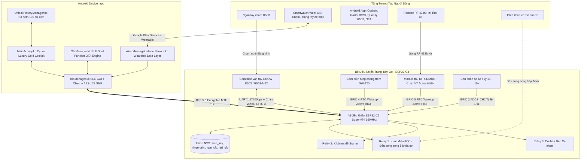
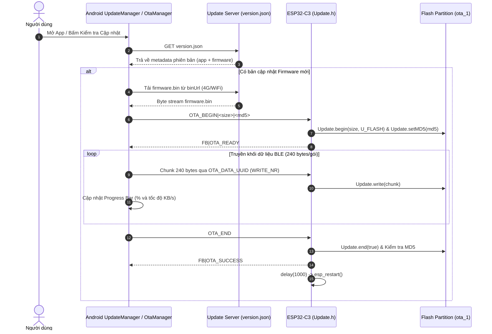

# TSMARTKEY - BỘ TÀI LIỆU TOÀN DIỆN HỆ THỐNG (SYSTEM MASTER ARCHITECTURE & SPECIFICATION)

> **MỤC ĐÍCH TÀI LIỆU**: Đây là bản tài liệu tổng thể (Single Source of Truth) của toàn bộ dự án **Tsmartkey**. Bất kỳ Kỹ sư phần mềm, Kỹ sư nhúng, Kỹ sư di động hoặc Trợ lý AI (Claude, GPT, Gemini, DeepSeek,...) khi đọc tài liệu này đều có thể nắm bắt 100% kiến trúc phần cứng, firmware ESP32-C3, ứng dụng Android, Wear OS, giao thức BLE bảo mật, và toàn bộ luồng hoạt động mà không cần đọc rà soát lại mã nguồn từ đầu.  
> **Phiên bản hệ thống**: 2.0.0 (Production-Ready Architecture)  
> **Nền tảng**: ESP32-C3 RISC-V + NimBLE 5.0 + Adafruit R503 + Android Kotlin + Wear OS Jetpack Compose  
> **Ngày cập nhật**: 2026-09-27  

---

## LỜI NHẮC NGỮ CẢNH DÀNH CHO AI (CONTEXT PRIMING PROMPT)
```text
BẠN ĐANG LÀM VIỆC VỚI DỰ ÁN "TSMARTKEY":
- Dự án là hệ thống Khóa Thông Minh (Smartkey) cho xe máy (tiêu chuẩn xe Honda SH / xe tay ga / xe số / xe điện).
- Phần cứng trung tâm: ESP32-C3 SuperMini (MCU RISC-V 32-bit 160MHz, 4MB Flash, BLE 5.0).
- Cảm biến sinh trắc học: Hangzhou Grow R503 / R503-M22 (UART 57600 baud, LED hào quang Aura RGB Opcode 0x35, chân ngắt WAKE chạm điện dung).
- Ứng dụng điều khiển: Android App (Kotlin, BleManager GATT, OtaManager, UnlockHistoryManager) & Wear OS Smartwatch (Jetpack Compose, nhận diện búng tay đề máy).
- Cơ chế an toàn sống còn: Fail-Safe chuẩn công nghiệp ô tô. Khi xe đang mở khóa chạy ngoài đường, mất kết nối Bluetooth BLE TUYỆT ĐỐI KHÔNG ĐƯỢC TẮT NGUỒN RELAY 1.
- Tiếp điểm Relay 1 đấu song song 100% với ổ khóa cơ của xe máy để dự phòng phần cứng.
Hãy tuân thủ nghiêm ngặt tất cả các bảng mã lệnh, Golden Pinout, Flash NVS schema, và quy chuẩn giao tiếp được đặc tả chi tiết dưới đây.
```

---

## MỤC LỤC CHI TIẾT
1. [Tổng quan hệ sinh thái & Kiến trúc luồng hoạt động](#1-tổng-quan-hệ-sinh-thái--kiến-trúc-luồng-hoạt-động)
2. [Sơ đồ phần cứng & Bảng Golden Pinout ESP32-C3](#2-sơ-đồ-phần-cứng--bảng-golden-pinout-esp32-c3)
3. [Bộ nhớ Flash NVS & Bảng phân vùng Dual OTA (4MB Flash)](#3-bộ-nhớ-flash-nvs--bảng-phân-vùng-dual-ota-4mb-flash)
4. [Giao thức truyền thông BLE & Bảo mật phần cứng AES-128 SMP](#4-giao-thức-truyền-thông-ble--bảo-mật-phần-cứng-aes-128-smp)
5. [Đặc tả quy trình nạp Firmware từ xa BLE OTA (Over-The-Air)](#5-đặc-tả-quy-trình-nạp-firmware-từ-xa-ble-ota-over-the-air)
6. [Đặc tả cảm biến vân tay R503 & Đèn vòng hào quang Aura RGB 360°](#6-đặc-tả-cảm-biến-vân-tay-r503--đèn-vòng-hào-quang-aura-rgb-360)
7. [Chế độ chống nước mưa (Anti-Rain) & Tinh chỉnh cảm biến](#7-chế-độ-chống-nước-mưa-anti-rain--tinh-chỉnh-cảm-biến)
8. [Quản lý nguồn 2 tầng (Tier 1 Power Saving & Tier 2 Deep Sleep)](#8-quản-lý-nguồn-2-tầng-tier-1-power-saving--tier-2-deep-sleep)
9. [Đặc tả ứng dụng Android (`:app`) & Đồng hồ Wear OS (`:wear`)](#9-đặc-tả-ứng-dụng-android-app--đồng-hồ-wear-os-wear)
10. [Kiến trúc an toàn Fail-Safe & Cơ chế cứu hộ sự cố thực tế](#10-kiến-trúc-an-toàn-fail-safe--cơ-chế-cứu-hộ-sự-cố-thực-tế)
11. [Cấu trúc thư mục toàn dự án & Hướng dẫn Build / Flash](#11-cấu-trúc-thư-mục-toàn-dự-án--hướng-dẫn-build--flash)

---

## 1. TỔNG QUAN HỆ SINH THÁI & KIẾN TRÚC LUỒNG HOẠT ĐỘNG

### 1.1 Mục đích và chức năng cốt lõi
Tsmartkey mang đến trải nghiệm mở khóa không chìa (Keyless Go) hoàn chỉnh và bảo mật vượt trội cho xe máy:
1. **Mở / Khóa xe bằng Cảm biến vân tay một chạm R503**:
   - Khi xe đang tắt (`isUnlocked == false`): Chạm ngón tay đã đăng ký $\rightarrow$ Đóng Relay 1 (Cấp điện ACC xe), nháy LED Aura màu xanh, bíp 1 tiếng. Người lái chỉ việc bấm nút đề xe trên tay lái để khởi hành.
   - Khi xe đang bật (`isUnlocked == true`): Chạm ngón tay hợp lệ $\rightarrow$ Ngắt Relay 1 (Tắt điện ACC), nháy LED Aura màu đỏ, bíp 2 tiếng.
   - Quét sai: LED nháy đỏ cảnh báo, còi tít tít. Nếu quẹt sai 3 lần liên tiếp: Kích hoạt còi hú báo động chống trộm 6 tiếng.
2. **Điều khiển từ xa qua Ứng dụng Di động Android**:
   - Mở khóa / Khóa xe tức thời qua Bluetooth Low Energy (BLE 5.0).
   - Kích đề nổ từ xa bằng nút ấn trên giao diện (Relay 2 đóng trong 1.5s).
   - Tìm xe trong bãi đỗ / hầm xe qua còi và xi-nhan (Relay 3 kích hoạt 3.0s).
   - Radar tìm xe 360° đo khoảng cách BLE RSSI theo thời gian thực (1.5m, 3.5m, 8.0m, 15m).
   - Quản lý toàn diện vân tay: Thêm mới (hỗ trợ lấy mẫu 2 bước hoặc 4 bước góc rộng, truyền ảnh quang học), Đổi tên gợi nhớ, Xóa từng ngón, Xóa toàn bộ.
   - Tùy biến bánh xe màu RGB cho đèn hào quang R503 theo 4 sự kiện.
   - Bật/tắt và cấu hình chế độ chống nước mưa (Anti-Rain Mode).
   - Nâng cấp firmware không dây BLE OTA trực tiếp từ file `.bin`.
3. **Điều khiển rảnh tay từ Đồng hồ thông minh Wear OS**:
   - Giao diện Jetpack Compose tròn tối ưu cho màn hình đồng hồ.
   - Nút Hero mở/khóa xe và đề nổ máy.
   - **Tính năng độc quyền: Búng tay đề xe (Pinch Gesture)** bằng thuật toán nhận diện gia tốc tuyến tính `Sensor.TYPE_LINEAR_ACCELERATION` (ngưỡng $> 18\text{ m/s}^2$).
   - Đồng bộ thông suốt qua Google Wearable Data Layer tới dịch vụ chạy ngầm `WearMessageListenerService.kt` trên điện thoại.
4. **Tìm xe qua Remote RF 433MHz**:
   - Nhận tín hiệu từ tay bấm remote RF 433MHz để kích nháy xi-nhan và còi tìm xe.
   - Chính sách an ninh: Module RF chỉ dùng tìm xe (Locate-Only), tuyệt đối không mở khóa để triệt tiêu nguy cơ sao chép sóng RF.
5. **Dự phòng vật lý 100% (Hardware Fail-Safe Override)**:
   - Tiếp điểm thường mở của Relay 1 đấu song song với 2 dây công tắc ổ khóa cơ zin của xe.
   - Bất kể khi ESP32 hỏng hóc, chập nguồn hay hết ắc quy, người dùng chỉ cần cắm chìa khóa cơ vặn lên là xe có điện nổ máy bình thường.

### 1.2 Sơ đồ khối kiến trúc hệ thống (System Architecture)



---

## 2. SƠ ĐỒ PHẦN CỨNG & BẢNG GOLDEN PINOUT ESP32-C3

### 2.1 Bảng Golden Pinout chuẩn công nghiệp (Chống xung đột Boot & Ngắt RTC)
Bo mạch sử dụng là **ESP32-C3 SuperMini**. Các chân GPIO được tính toán kỹ lưỡng nhằm tránh hoàn toàn các chân Strapping nhạy cảm lúc boot:

| Chân ESP32-C3 | Nhóm chức năng | Hướng I/O | Ngoại vi kết nối | Đặc tính kỹ thuật & Lý do lựa chọn |
| :---: | :---: | :---: | :--- | :--- |
| **`GPIO 6`** | General Digital | Output | **Relay 1 (Khóa điện ACC)** | Chân sạch 100%, không bị giật xung (glitch) lúc nạp bootloader. Tiếp điểm COM-NO đấu song song 2 dây ổ khóa cơ. |
| **`GPIO 7`** | General Digital | Output | **Relay 2 (Kích đề Starter)** | Logic **Active LOW** (Kích hoạt đề = LOW/0V, Tắt = HIGH/3.3V). Kích nút đề xe trong 1.5 giây khi có lệnh hợp lệ. Mặc định kéo HIGH lúc khởi động chống giật relay và chống tự đề nổ máy. |
| **`GPIO 10`** | General Digital | Output | **Relay 3 (Còi & Xi-nhan)** | Logic **Active LOW** (Kích hoạt còi/đèn = LOW/0V, Tắt = HIGH/3.3V). Kích hoạt còi và đèn chớp khi tìm xe hoặc báo động chống trộm. Chế độ Bật/Tắt xe thông thường hoàn toàn êm ái (Silent ACC). |
| **`GPIO 3`** | **RTC GPIO** | Input (Pull-up) | **R503 WAKEUP (Dây Xanh dương)** | Chân cảm ứng điện dung R503. Logic **Active LOW** (Bình thường = 3.2V, ngón tay chạm lăng kính = 0V). Đánh thức MCU từ Deep Sleep trong 15ms. Sạch 100%, **không phải Strapping Pin**, triệt tiêu hoàn toàn lỗi kẹt ROM Bootloader. |
| **`GPIO 4`** | **RTC GPIO** | Input (Pull-down) | **Cảm biến rung SW-420 (DO)** | Giám sát tác động rung lắc khi xe đang khóa (chỉ kích hoạt khi bật Chống dắt trên App/NVS). Logic **Active HIGH** (Bình thường = 0V, khi xe rung = 3.3V). Đánh thức MCU từ Deep Sleep qua ngắt RTC mức HIGH. |
| **`GPIO 5`** | **RTC GPIO** | Input (Pull-down / Pull-up) | **Module RF 433MHz (Chân VT)** | Nhận trực tiếp tín hiệu từ chân VT (Valid Transmission) của module thu RF 433MHz. Logic **Active HIGH** (Bình thường = 0V, bấm remote = 3.3V). Đánh thức MCU từ Deep Sleep qua ngắt RTC mức HIGH (`ESP_GPIO_WAKEUP_GPIO_HIGH`). |
| **`GPIO 0`** | RTC / UART1 | Input (RX1) | **R503 TXD (Dây Vàng)** | Chân nhận gói tin dữ liệu và ảnh quang học từ cảm biến R503. |
| **`GPIO 1`** | RTC / UART1 | Output (TX1) | **R503 RXD (Dây Xanh lá)** | Chân phát lệnh điều khiển đèn Aura và xác thực tới cảm biến R503. |
| **`GPIO 8`** | Strapping Pin | Output | **LED Xanh Onboard SuperMini** | Đèn LED trạng thái trên bo mạch. Logic **Active LOW**. Không kéo dây ra ngoài để bảo vệ mức logic lúc khởi động. |
| **`GPIO 9`** | Strapping Pin | Input | **Nút BOOT Onboard** | Để trống (NC). Đảm bảo MCU luôn vào chế độ Run Mode bình thường, không kẹt Download Mode. |
| **`GPIO 2`** | Strapping Pin / ADC1_CH2 | Input / ADC (`ANALOG`) | **Đo điện áp bình ắc quy (Battery ADC)** | Mạch cầu phân áp $R_1=100\text{k}\Omega$ (nối $V_{BAT}$), $R_2=10\text{k}\Omega$ (nối GND). Tỷ lệ phân áp lý thuyết $1/11$ ($V_{ADC} = V_{BAT} \times 10 / 110$). Cấu hình `pinMode(BATTERY_ADC_PIN, ANALOG)` và tích hợp hệ số hiệu chuẩn `batteryVoltageCalib` (mặc định $12.0/23.6$) bù trừ sai lệch đặc tính ADC ESP32-C3. Khuyến nghị gắn thêm tụ gốm $100\text{nF}$ từ GPIO 2 xuống GND để lọc phẳng nhiễu sóng RF BLE. An toàn cho ADC ($0 - 2.5\text{V}$ đo dải $0 - 27.5\text{V}$). |
| **`3.3V`** | Nguồn | Power OUT | **VCC R503 & Touch Power** | Cấp nguồn 3.3VDC ổn định sau mạch Buck hạ áp. |
| **`GND`** | Nối đất | Ground | **GND chung toàn hệ thống** | Đấu chung Mass của ESP32, Cảm biến R503, SW-420, RF và Relay. |

### 2.2 Sơ đồ cáp 6 dây của cảm biến vân tay GROW R503 / R503-M22
Cảm biến sử dụng đầu cắm chuẩn MX1.0mm 6-pin:
```text
Cáp R503 (MX1.0mm 6-Pin):
1. ĐỎ         : VCC 3.3V       ---> Cấp nguồn 3.3V ổn định
2. ĐEN        : GND            ---> Mass chung (GND)
3. VÀNG       : TXD (Sensor)   ---> Nối vào GPIO 0 (ESP32-C3 RX1)
4. XANH LÁ    : RXD (Sensor)   ---> Nối vào GPIO 1 (ESP32-C3 TX1)
5. XANH DƯƠNG : WAKEUP (Touch) ---> Nối vào GPIO 3 (Ngắt RTC Wakeup, Active LOW: Nghỉ=3.2V, Chạm=0V - Không kẹt Boot)
6. TRẮNG      : 3.3V_TOUCH     ---> Nối vào nguồn 3.3V (Cấp điện cho mạch cảm ứng chạm điện dung)
```

### 2.3 Giải pháp kỹ thuật UART1 độc lập & Constructor Fix cho Adafruit Fingerprint
- **Tách biệt hoàn toàn USB CDC và UART ngoại vi**:  
  Nhờ cờ `-DARDUINO_USB_MODE=1` và `-DARDUINO_USB_CDC_ON_BOOT=1` trong `platformio.ini`, cổng nạp và Serial Monitor đi qua khối USB CDC nội bộ của ESP32-C3. Cổng UART1 phần cứng được giải phóng hoàn toàn cho GPIO 0 và GPIO 1 kết nối R503.
- **Kỹ thuật ép kiểu `(Stream*)&r503Serial` (Constructor Collision Prevention)**:  
  Thư viện `Adafruit_Fingerprint` có 2 constructor: `(HardwareSerial*)` và `(Stream*)`. Nếu truyền `&r503Serial` trực tiếp, thư viện sẽ vô tình gọi `hwSerial->begin(57600)` đè lên chân phần cứng và reset chân RX/TX về mặc định (`-1, -1`), gây đứt liên lạc UART.  
  Ép kiểu sang `(Stream*)&r503Serial` buộc thư viện sử dụng Constructor dạng luồng trừu tượng, quyền cấu hình GPIO 0 và GPIO 1 thuộc toàn quyền của firmware:
  ```cpp
  HardwareSerial r503Serial(1);
  Adafruit_Fingerprint finger = Adafruit_Fingerprint((Stream*)&r503Serial);
  ```
- **Vòng quét Baudrate tự phục hồi (Baudrate Auto-Scan Failsafe)**:  
  Hệ thống hỗ trợ quét qua các tốc độ `{57600, 9600, 115200, 19200, 38400}`. Khi chuyển đổi tốc độ, firmware bắt buộc gọi `r503Serial.end(); delay(30);` để dọn sạch thanh ghi FIFO và ngắt UART, loại bỏ hoàn toàn nguy cơ treo chip.

### 2.4 Sơ đồ nguyên lý mạch đo điện áp bình ắc quy (GPIO 2 - Cầu phân áp 1k - 10k)
Chân **GPIO 2 (ADC1_CH2)** được kết nối với mạch cầu phân áp điện trở chính xác cao để theo dõi điện áp bình ắc quy 12V xe máy (dải đo thực tế từ 10.0V đến 15.0V khi sạc):
```text
Cực dương Bình Ắc quy (V_BAT: 12V - 14.4V)
           │
          ┌┴┐
          │ │ R1 = 10kΩ (Điện trở cầu trên)
          └┬┘
           ├────────────────────────────► Nối vào GPIO 2 (ESP32-C3 ADC1_CH2)
          ┌┴┐                            (V_ADC = V_BAT / 11)
          │ │ R2 = 1kΩ (Điện trở cầu dưới)
          └┬┘
           │
          GND (Mass chung xe máy)
```
- **Công thức tính toán phân áp**:  
  $$V_{ADC} = V_{BAT} \times \frac{R_2}{R_1 + R_2} = V_{BAT} \times \frac{1\text{k}\Omega}{10\text{k}\Omega + 1\text{k}\Omega} = \frac{V_{BAT}}{11} \approx 0.0909 \times V_{BAT}$$  
- **Bảng quy đổi điện áp mẫu**:
  - Khi $V_{BAT} = 12.0\text{V}$ (Bình bình thường) $\rightarrow V_{ADC} = 1.091\text{V}$ ($1091\text{mV}$).
  - Khi $V_{BAT} = 12.6\text{V}$ (Bình đầy) $\rightarrow V_{ADC} = 1.145\text{V}$ ($1145\text{mV}$).
  - Khi $V_{BAT} = 14.4\text{V}$ (Đang nổ máy sạc dynamo) $\rightarrow V_{ADC} = 1.309\text{V}$ ($1309\text{mV}$).
  - Khi $V_{BAT} = 11.5\text{V}$ (Cảnh báo bình yếu) $\rightarrow V_{ADC} = 1.045\text{V}$ ($1045\text{mV}$).
- **Bảo vệ và tuyến tính**: Cấu hình `analogSetAttenuation(ADC_11db)` cho phép dải đo tuyến tính lên đến $2.5\text{V} - 3.1\text{V}$, tương đương chịu được điện áp ắc quy vọt đỉnh lên tới $> 27\text{V}$, triệt tiêu nguy cơ hỏng chân vi điều khiển.
- **Lưu ý Strapping Pin GPIO 2**: Trong ESP32-C3, GPIO 2 là strapping pin nhưng chỉ được MCU kiểm tra khi GPIO 9 = 0 (Download Mode). Trong chế độ hoạt động bình thường (Run Mode, GPIO 9 = 1), trở phân áp $1\text{k}\Omega$ xuống GND hoàn toàn không ảnh hưởng tới quá trình khởi động nạp code từ Flash SPI.

### 2.5 Sơ đồ kết nối Module thu sóng RF 433MHz (GPIO 5 - Chân VT Active HIGH)
Chân **GPIO 5** nhận trực tiếp tín hiệu từ chân **VT (Valid Transmission)** của các module thu sóng 433MHz phổ biến (RX480E, RX480R, PT2272, SYN480R):
```text
  Module Thu RF 433MHz                     ESP32-C3 SuperMini
 ┌─────────────────────────┐              ┌──────────────────┐
 │ VCC (3.3V)              │<────────────>│ 3.3V             │
 │ GND                     │<────────────>│ GND              │
 │ VT (Valid Transmission) │─────────────>│ GPIO 5 (RTC WAKE)│
 └─────────────────────────┘              └──────────────────┘
```
- **Nguyên lý hoạt động**:  
  - Khi ở trạng thái chờ (không có nút bấm remote): Chân VT giữ mức **LOW (0V)**.
  - Khi người dùng bấm nút trên remote RF 433MHz: Module giải mã thành công mã lệnh và kéo chân VT lên mức **HIGH (3.3V)** trong suốt thời gian bấm giữ nút.
  - Firmware cấu hình `pinMode(GPIO 5, INPUT_PULLDOWN)` để tránh trôi áp, và bắt sự kiện `digitalRead(GPIO 5) == HIGH` với thời gian trễ chống dội (debounce cooldown) $1500\text{ms}$.
- **Đánh thức từ Deep Sleep (Tầng 2)**:  
  Sử dụng ngắt RTC mức cao: `esp_deep_sleep_enable_gpio_wakeup((1ULL << RF_LOCATE_PIN), ESP_GPIO_WAKEUP_GPIO_HIGH);` giúp MCU thức dậy tức thì trong $15\text{ms}$ để kích hoạt còi và xi-nhan tìm xe.

---

## 3. BỘ NHỚ FLASH NVS & BẢNG PHÂN VÙNG DUAL OTA (4MB FLASH)

### 3.1 Cấu hình phân vùng Dual OTA (`partitions.csv`)
Dự án phân bổ 4MB Flash của ESP32-C3 theo mô hình Dual-Partition chuẩn công nghiệp, cho phép nâng cấp chương trình qua Bluetooth BLE mà không lo bị brick vi điều khiển:

```csv
# Name,   Type, SubType, Offset,   Size,     Flags
nvs,      data, nvs,     0x9000,   0x4000,   # 16 KB: Lưu khóa bí mật, cấu hình xe, danh bạ vân tay
otadata,  data, ota,     0xd000,   0x2000,   #  8 KB: Bootloader quản lý active partition
app0,     app,  ota_0,   0x10000,  0x1e0000, # 1.875 MB: Phân vùng chạy chính (Factory/Current)
app1,     app,  ota_1,   0x1f0000, 0x1e0000, # 1.875 MB: Phân vùng nạp OTA không dây
```

### 3.2 Quy hoạch cấu trúc Namespaces trong Flash NVS (`Preferences`)
Hệ thống sử dụng thư viện `Preferences` (Non-Volatile Storage) với 4 namespaces độc lập, đảm bảo dữ liệu không bị ghi đè lẫn nhau:

| Namespace | Key | Kiểu dữ liệu | Giá trị mặc định | Diễn giải chức năng |
| :--- | :--- | :---: | :---: | :--- |
| **`"safe_key"`** | `"master_key"` | `String` | `"271000"` | Mật khẩu quản trị và mã Passkey BLE 6 số |
| | `"is_unlocked"`| `bool` | `false` | Trạng thái nguồn xe (khôi phục tức thì khi mất điện nguồn) |
| **`"fingerprint"`**| `"name_<id>"` | `String` | `"Vân tay <id>"` | Tên gợi nhớ tương ứng với từng ID vân tay (1..200) |
| | `"sec_level"` | `int` | `2` | Mức bảo mật R503 (1: Dễ dãi $\rightarrow$ 5: Khắt khe) |
| | `"scan_win"` | `int` | `1200` | Thời gian quét đối chiếu liên tục khi chạm ngón (ms) |
| | `"enroll_mode"`| `int` | `4` | Chế độ lấy mẫu vân tay: 2 lần chạm hoặc 4 lần chạm góc rộng |
| | `"send_img"` | `bool` | `false` | Bật/Tắt truyền ảnh vân tay quang học lên app khi nạp mẫu |
| **`"rain_config"`**| `"enabled"` | `bool` | `false` | Bật/Tắt chế độ chống nước mưa (Anti-Rain) |
| | `"touch_hold"` | `int` | `500` | Thời gian chạm giữ tối thiểu (ms) để lọc giọt nước lướt qua |
| | `"max_wrong"` | `int` | `5` | Ngưỡng quẹt sai tối đa trước khi tạm khóa cảm biến |
| | `"cooldown"` | `int` | `30` | Thời gian tạm khóa cảm biến khi kích hoạt bảo vệ mưa (giây) |
| | `"auto_off"` | `int` | `3600` | Thời gian tự tắt chế độ mưa (giây, 0 = không tự tắt) |
| **`"led_cfg"`** | 12 tham số | `uint8_t` | *(Mặc định tối ưu)*| Cấu hình Mode, Color, Speed cho 4 sự kiện đèn Aura RGB R503 |

---

## 4. GIAO THỨC TRUYỀN THÔNG BLE & BẢO MẬT PHẦN CỨNG AES-128 SMP

### 4.1 Thông số BLE GATT Service & UUIDs
- **Tên thiết bị phát sóng (Device Name)**: `XE_tsmart_BLE`
- **Mức công suất phát sóng (TX Power)**: `ESP_PWR_LVL_P9` (+9dBm - Mức cực đại, chống rớt sóng trong cốp xe)
- **Kích thước gói tin đệm (MTU)**: `517 bytes`
- **Danh mục UUIDs**:
  - **Service UUID**: `0000ff01-0000-1000-8000-00805f9b34fb`
  - **Command / Feedback Characteristic UUID**: `0000ff02-0000-1000-8000-00805f9b34fb`  
    *Thuộc tính*: `READ | READ_ENC | READ_AUTHEN | WRITE | WRITE_ENC | WRITE_AUTHEN | WRITE_NR | NOTIFY`
  - **OTA Data Characteristic UUID**: `0000ff03-0000-1000-8000-00805f9b34fb`  
    *Thuộc tính*: `WRITE | WRITE_NR | WRITE_ENC | WRITE_AUTHEN`

### 4.2 Tầng bảo mật phần cứng BLE Security Manager Protocol (SMP)
Dự án áp dụng cơ chế bảo mật phần cứng BLE chuẩn công nghiệp theo mô hình **Phòng thủ chiều sâu (Defense-in-Depth)**:
1. **Ghép đôi & Khóa bảo mật (Pairing & Bonding)**:  
   - Cờ cấu hình: `setSecurityAuth(bonding = true, mitm = true, sc = true)`.
   - Chuẩn bảo mật **LE Secure Connections (LESC)** sử dụng mật mã đường cong Elliptic P-256 kết hợp mã hóa luồng dữ liệu **AES-128**.
   - Thiết bị lạ chưa ghép đôi khi cố đọc/ghi sẽ bị phần cứng từ chối với lỗi `BLE_ATT_ERR_INSUFFICIENT_AUTHEN`. Hệ điều hành Android sẽ tự động bật hộp thoại hệ thống yêu cầu nhập mã PIN.
2. **Mã Passkey 6 số đồng bộ**:  
   - Passkey phần cứng được đồng bộ trực tiếp từ `SECRET_KEY` (mặc định: `271000`).
   - I/O Capability: `BLE_HS_IO_DISPLAY_ONLY`. Xe cung cấp mã cố định, điện thoại chịu trách nhiệm nhập mã.
3. **Cơ chế chống dò mã (Anti-Brute-Force Lockout)**:  
   - Nếu Client cố tình gửi 3 gói tin sai `SECRET_KEY` liên tiếp, ESP32 sẽ chủ động hủy kết nối BLE và tạm ngắt giao dịch để ngăn chặn kẻ xấu dò mật khẩu.
4. **Lệnh thu hồi khóa ghép đôi (`UNPAIR_ALL`)**:  
   - Cho phép người dùng xóa sạch toàn bộ danh sách Bonding trên Flash NVS khi mất điện thoại hoặc đổi chủ xe.

### 4.3 Định dạng gói tin truyền thông
Mọi gói tin điều khiển từ App gửi tới ESP32 bắt buộc tuân thủ cấu trúc:
$$\text{<SECRET\_KEY>|<COMMAND>[|<PARAM1>|<PARAM2>|...]\n}$$

### 4.4 Bảng mã lệnh đầy đủ (App $\rightarrow$ ESP32-C3)

| Nhóm chức năng | Lệnh (`cmd`) | Tham số (`params`) | Hành vi xử lý trên ESP32-C3 |
| :--- | :--- | :--- | :--- |
| **Điều khiển cơ bản** | `1` | Không | **Mở khóa xe**: Đóng Relay 1 (ACC ON), lưu flash, đèn Aura xanh, bíp 1 tiếng. |
| | `0` | Không | **Khóa xe**: Ngắt Relay 1 (ACC OFF), lưu flash, đèn Aura đỏ, bíp 2 tiếng. |
| | `2` | Không | **Đề xe**: Kích Relay 2 trong 1.5s (chỉ thực hiện khi xe đang mở khóa). |
| | `3` | Không | **Tìm xe**: Kích Relay 3 (còi & xi-nhan) trong 3.0s. |
| | `TELE` / `STATUS` | Không | Yêu cầu ESP32 phản hồi trạng thái xe và dữ liệu Telemetry tức thời. |
| **Quản trị bảo mật & Tên xe** | `9` | `<NEW_KEY>` | **Đổi mã bảo mật**: Lưu `SECRET_KEY` mới vào NVS và cập nhật Passkey BLE SMP. |
| | `SET_NAME` | `<TÊN_XE>` | **Đổi tên xe riêng**: Lưu tên riêng của xe vào Flash NVS và cập nhật BLE name. |
| | `GET_NAME` | Không | Đọc tên riêng của xe đang lưu trong Flash NVS (`VEHICLE_NAME\|<name>`). |
| | `UNPAIR_ALL` | Không | **Xóa toàn bộ thiết bị ghép đôi**: Xóa sạch danh sách Bonding trong NVS. |
| | `SLEEP_NOW` | Không | Yêu cầu ESP32 chuyển ngay sang **Tầng 2: Deep Sleep**. |
| **Quản lý vân tay** | `FP_LIST` | Không | Yêu cầu gửi danh sách toàn bộ ID và tên vân tay hiện có. |
| | `FP_ENROLL` | `<TÊN>[\|IMG]` | **Thêm vân tay mới**: Khởi chạy FreeRTOS Task lấy mẫu vân tay 2 hoặc 4 bước. |
| | `FP_CANCEL` | Không | Hủy bỏ tiến trình lấy mẫu vân tay đang diễn ra. |
| | `FP_DELETE` | `<ID>` | Xóa mẫu vân tay trong cảm biến R503 và xóa tên trong Flash NVS. |
| | `FP_RENAME` | `<ID>\|<TÊN_MỚI>`| Đổi tên gợi nhớ của vân tay trong Flash NVS. |
| | `FP_CLEAR` | `CONFIRM` | Xóa sạch toàn bộ thư viện vân tay trên R503 và Flash NVS. |
| | `CAPTURE_FP_IMG` | Không | Chụp ảnh quang học thực tế và truyền tải về điện thoại qua các chunk. |
| **Tinh chỉnh cảm biến**| `GET_FP_CFG` | Không | Đọc cấu hình độ nhạy, thời gian quét và chế độ lấy mẫu của R503. |
| | `SET_FP_CFG` | `<sec>\|<win>\|<mod>\|`| Lưu cấu hình: Security Level (1..5), Scan Window (ms), Mode (2/4), Send Image. |
| | `TEST_FP` | `<dur_sec>` | Bật chế độ Live Test cảm biến vân tay trong N giây (không bật/tắt xe). |
| **Chế độ nước mưa** | `GET_RAIN` | Không | Đọc toàn bộ thông số chế độ chống nước mưa hiện tại. |
| | `TOGGLE_RAIN` | `1` hoặc `0` | Bật hoặc tắt nhanh chế độ chống nước mưa. |
| | `SET_RAIN` | `<en>\|<hld>\|<wrg>\|<cd>\|<off>`| Cài đặt: Bật/Tắt, Chạm giữ (ms), Quẹt sai tối đa, Cooldown (s), Tự tắt (s). |
| **Đèn vòng Aura RGB** | `GET_LED_CFG` | Không | Đọc 12 tham số màu sắc & hiệu ứng cho 4 sự kiện đèn. |
| | `SET_LED_CFG` | `12 tham số` | Lưu cấu hình đèn Aura cho 4 sự kiện (Unlocked, Locked, Success, Error). |
| | `TEST_LED` | `<m>\|<c>\|<s>\|<cnt>`| Thử nghiệm nhanh hiệu ứng đèn thực tế trên R503 (Live Test). |
| **Nâng cấp OTA** | `OTA_BEGIN` | `<size>\|<md5>` | Khởi tạo tiến trình nạp OTA, cấp phát phân vùng và kiểm tra điều kiện an toàn. |
| | `OTA_END` | Không | Kết thúc truyền dữ liệu, xác thực checksum MD5 và tự khởi động lại MCU. |
| | `OTA_ABORT` | Không | Hủy bỏ tiến trình nạp OTA và giải phóng tài nguyên. |

### 4.5 Bảng phản hồi trạng thái từ ESP32 gửi lên App (`FB|<STATUS>`)

| Gói tin phản hồi | Diễn giải ngữ nghĩa kỹ thuật |
| :--- | :--- |
| `FB\|DA_MO_KHOA` | Xe đã kích hoạt đóng Relay 1 (ACC ON) thành công |
| `FB\|DA_KHOA_XE` | Xe đã ngắt Relay 1 (ACC OFF) thành công |
| `FB\|DA_DE_MAY` | Đã kích đóng Relay 2 đề nổ máy |
| `FB\|DA_TIM_XE` | Đang kích Relay 3 phát tín hiệu còi / xi-nhan tìm xe |
| `FB\|TELE\|<V>\|<TEMP>\|<STAT>`| Dữ liệu Telemetry: Điện áp ắc quy, Nhiệt độ chip ESP32, Trạng thái khóa |
| `FB\|DA_DOI_KEY` | Đã đổi mã bảo mật và Passkey BLE thành công |
| `FB\|UNPAIR_ALL_OK` | Đã xóa sạch toàn bộ danh sách thiết bị Bonding |
| `FB\|LOI_SAI_KEY` | Mã bảo mật gửi kèm không hợp lệ |
| `FB\|FP_LIST_START` | Bắt đầu chuỗi truyền danh sách vân tay |
| `FB\|FP_ITEM\|<ID>\|<NAME>` | Dữ liệu từng mẫu vân tay đã đăng ký |
| `FB\|FP_LIST_END` | Hoàn tất truyền toàn bộ danh sách vân tay |
| `FB\|FP_ENROLL_STEP_1\|<ID>` | Vui lòng áp ngón tay lần 1 lên cảm biến R503 |
| `FB\|FP_ENROLL_STEP_2\|<ID>` | Nhấc ngón tay ra và áp lại lần 2 |
| `FB\|FP_ENROLL_OK\|<ID>\|<NAME>`| Đăng ký vân tay mới thành công và đã lưu vào NVS |
| `FB\|FP_ENROLL_FAILED\|<LÝ_DO>`| Đăng ký thất bại (Timeout, mờ, không khớp góc chạm) |
| `FB\|FP_MATCHED\|<ID>\|<NAME>` | Quẹt vân tay đúng $\rightarrow$ Đổi trạng thái Bật/Tắt xe thành công |
| `FB\|FP_NOT_MATCH` | Cảnh báo: Quẹt vân tay không trùng khớp |
| `FB\|LED_CFG_OK` | Đã lưu cấu hình 12 tham số đèn Aura RGB thành công |
| `FB\|RAIN_CONFIG\|<7 tham số>`| Cấu hình chi tiết chế độ chống nước mưa kèm thời gian đếm ngược còn lại |
| `FB\|OTA_READY` | ESP32 đã sẵn sàng nhận các khối dữ liệu binary firmware qua OTA |
| `FB\|OTA_SUCCESS` | Nâng cấp OTA thành công 100%, chuẩn bị nạp phân vùng mới |
| `FB\|OTA_ERR_VEHICLE_ON` | Từ chối nạp OTA vì xe đang mở khóa nguồn điện ACC (Quy tắc an toàn) |
| `FB\|OTA_ERR_BUSY` | Từ chối OTA vì ESP32 đang bận lấy mẫu vân tay hoặc chụp ảnh |
| `FB\|OTA_ERR_INVALID_SIZE` | Kích thước file firmware vượt quá dung lượng phân vùng 1.875MB |
| `FB\|OTA_ERR_VERIFY` | Lỗi kiểm tra tính toàn vẹn: Checksum MD5 không khớp |
| `FB\|OTA_TIMEOUT` | Quá 15 giây không nhận thêm khối dữ liệu, tiến trình tự hủy |

---

## 5. ĐẶC TẢ HỆ THỐNG CẬP NHẬT TỪ XA TOÀN DIỆN (IN-APP APK & DUAL OTA FIRMWARE)

### 5.1 Kiến trúc phân phối phiên bản tập trung (`version.json`)
Hệ thống sử dụng file metadata chuẩn `version.json` được lưu trữ tại Server nội bộ (hoặc Cloud/DuckDNS/GitHub Releases):
- **URL mặc định**: `http://192.168.1.114:3002/api/v1/repos/nas152/Tysmartkey/raw/version.json`
- **Cấu trúc JSON**:
```json
{
  "app": {
    "versionCode": 3,
    "versionName": "1.0.2",
    "apkUrl": "http://192.168.1.114:3002/nas152/Tysmartkey/releases/download/v1.0.2/app-debug.apk",
    "apkName": "app-debug.apk",
    "changelog": "• Cập nhật giao diện và cải thiện độ ổn định kết nối BLE\n• Hỗ trợ hiệu chuẩn điện áp ắc quy chính xác\n• Tích hợp tính năng cập nhật In-App và OTA Firmware từ xa"
  },
  "firmware": {
    "versionCode": 3,
    "versionName": "1.0.2",
    "binUrl": "http://192.168.1.114:3002/nas152/Tysmartkey/releases/download/v1.0.2/firmware.bin",
    "binName": "firmware.bin",
    "changelog": "• Khắc phục đo điện áp ADC 12V hiển thị chuẩn xác 100%\n• Relay Starter & Còi Active-LOW chống giật xung khi khởi động\n• Hỗ trợ nạp Firmware OTA siêu tốc qua BLE và WiFi HTTP"
  }
}
```

### 5.2 Cơ chế Cập nhật Ứng dụng Di động (`UpdateManager.kt`)
1. **Kiểm tra phiên bản tự động**: So sánh `remoteVersionCode > BuildConfig.VERSION_CODE`.
2. **Hộp thoại Changelog Material Design**: Hiển thị chi tiết danh sách thay đổi và nút "Cập nhật ngay".
3. **Tải ngầm với tiến độ %**: Stream file APK về thư mục `context.getExternalFilesDir(Environment.DIRECTORY_DOWNLOADS)`.
4. **Cài đặt an toàn qua FileProvider**: Kích hoạt `ACTION_VIEW` với URI `content://com.example.control_esp.fileprovider/...` tương thích Android 7 đến Android 14/15.

### 5.3 Hai kênh nạp Firmware (Dual-Channel Firmware OTA)
Xe máy thường đỗ ở tầng hầm, ngoài bãi xe **không có sóng WiFi gia đình**. Hệ thống cung cấp 2 giải pháp nạp linh hoạt:
1. **Kênh 1: BLE OTA (Tối ưu cho xe máy ngoài đường - Không cần WiFi)**:
   - Điện thoại Android dùng 4G tải file `firmware.bin` từ `binUrl`.
   - `UpdateManager` chuyển `ByteArray` trực tiếp sang `OtaManager.startOtaWithBytes()`.
   - Truyền từng khối `240 bytes` qua đặc tính `OTA_DATA_UUID` (`WRITE_NR`, độ trễ 8ms) tới ESP32-C3.
   - ESP32-C3 xác thực mã băm MD5 và ghi trực tiếp vào phân vùng `ota_1` bằng thư viện `Update.h`.
2. **Kênh 2: WiFi HTTP OTA (Khi có mạng gia đình hoặc Điện thoại bật WiFi Hotspot)**:
   - Gửi lệnh BLE: `<KEY>|WIFI_OTA|<SSID>|<PASSWORD>` (hoặc kèm URL tùy chọn).
   - ESP32-C3 tự kết nối WiFi trong 15s, tải `version.json`, kiểm tra `remoteVersion > CURRENT_FW_VERSION`.
   - Sử dụng `HTTPUpdate.h` và `ArduinoJson` tải và ghi trực tiếp file `.bin` từ `binUrl` vào Flash SPI.
   - Nháy LED Aura tím báo hiệu, nháy LED Onboard GPIO 8 theo nhịp ghi Flash, tự khởi động lại khi hoàn tất.

### 5.4 Sơ đồ trình tự tiến trình BLE OTA (OTA Sequence Flow)



### 5.5 Quy tắc an toàn chống Brick vi điều khiển (Fail-Safe Rollback)
1. **Khóa chức năng khi nạp**: Khi `isOtaUpdating == true`, firmware tạm khóa toàn bộ việc quét vân tay, cảm biến rung, và vô hiệu hóa chế độ ngủ Deep Sleep.
2. **Chặn nạp khi xe đang chạy**: Nếu `isUnlocked == true`, lệnh OTA lập tức bị từ chối (`OTA_ERR_VEHICLE_ON`) để đảm bảo an toàn tuyệt đối khi xe đang lăn bánh.
3. **Timeout 15 giây**: Nếu quá 15 giây không nhận thêm khối dữ liệu mới (do mất sóng hoặc thoát app), ESP32 tự động gọi `Update.abort()`, hủy bỏ phân vùng nháp và quay về hoạt động bình thường.
4. **Mất kết nối đột ngột (GATT Disconnect)**: Sự kiện `onDisconnect()` tự động phát hiện nếu đang OTA sẽ lập tức hủy tiến trình an toàn, bảo vệ phân vùng đang chạy hiện tại.

### 5.6 Kiến trúc Dịch vụ chạy ngầm liên tục (Android Background Service & Always-Ready Connection)
Nhằm đảm bảo điện thoại luôn tự động kết nối xe ngay khi người dùng bước lại gần kể cả khi màn hình tắt hoặc đang dùng ứng dụng khác:
- **`VehicleBackgroundService` (Foreground Service chuẩn Android 12 - 15)**:
  - Khai báo `<uses-permission android:name="android.permission.FOREGROUND_SERVICE" />` và `FOREGROUND_SERVICE_CONNECTED_DEVICE`.
  - Giữ tiến trình luôn ưu tiên cao (High Priority) kèm thông báo hệ thống liên tục trên Notification Bar (`Ongoing Notification`).
  - **Miễn trừ tiết kiệm pin (`REQUEST_IGNORE_BATTERY_OPTIMIZATIONS`)**: Ngăn chặn Doze Mode của Android tắt Bluetooth ngầm.
  - **Vòng lặp tự phục hồi kết nối (Heartbeat Reconnect 8s)**: Tự động phát hiện khi xe vào vùng phủ sóng BLE (RSSI $\ge -90\text{ dBm}$) để thực hiện handshake và duy trì kết nối GATT.
  - Khi người dùng thoát giao diện `MainActivity`, kết nối BLE không bị ngắt (`onDestroy` không gọi `disconnectVehicle()` nếu chế độ chạy ngầm đang bật), cho phép điều khiển xe qua đồng hồ Wear OS và tự động mở khóa tức thì.

---

## 6. ĐẶC TẢ CẢM BIẾN VÂN TAY R503 & ĐÈN VÒNG HÀO QUANG AURA RGB 360°

### 6.1 Giao thức điều khiển đèn nhẫn hào quang (Aura LED Opcode 0x35)
Theo tài liệu kỹ thuật Hangzhou Grow R503 User Manual V1.4.1, cụm LED RGB tích hợp trên mặt lăng kính được điều khiển trực tiếp qua Opcode `0x35`:
- **Gói lệnh chuẩn UART**:
  $$\text{0xEF 0x01 | 0xFF 0xFF 0xFF 0xFF | 0x01 | 0x00 0x07 | 0x35 <Mode> <Color> <Speed> <Count> | Checksum}$$
- **7 Mã màu phần cứng (Hardware Color Codes)**:
  1. `0x01`: 🔴 **Đỏ (Sport Red)** (`#FF2D55`) - Báo lỗi / Quẹt sai / Cảnh báo chống trộm.
  2. `0x02`: 🔵 **Xanh Dương (Ocean Blue)** (`#007AFF`) - Trạng thái sẵn sàng / Xe đang bật điện.
  3. `0x03`: 🟣 **Tím (Cyberpunk Purple)** (`#AF52DE`) - Cảnh báo mất kết nối BLE / Đang đăng ký vân tay.
  4. `0x04`: 🟢 **Xanh Lá (Emerald Green)** (`#34C759`) - Quét đúng vân tay / Mở khóa thành công.
  5. `0x05`: 🟡 **Vàng (Solar Gold)** (`#FFCC00`) - Bộ nhận diện Luxury Gold của xe.
  6. `0x06`: 🐬 **Xanh Ngọc / Lơ (Cyan Neon)** (`#00F5D4`) - Hiện đại thể thao.
  7. `0x07`: ⚪ **Trắng (Pure White)** (`#FFFFFF`) - Sáng tối đa.
- **6 Kiểu hiệu ứng ánh sáng (Control Mode Codes)**:
  - `0x01` (`LED_MODE_BREATHING`): Thở êm dịu theo chu kỳ sin.
  - `0x02` (`LED_MODE_FLASHING`): Nhấp nháy theo tần số.
  - `0x03` (`LED_MODE_ON`): Bật sáng tĩnh liên tục.
  - `0x04` (`LED_MODE_OFF`): Tắt hoàn toàn (tiết kiệm điện năng bình ắc quy).
  - `0x05` (`LED_MODE_GRADUAL_ON`): Sáng từ từ.
  - `0x06` (`LED_MODE_GRADUAL_OFF`): Tắt từ từ.

### 6.2 Cấu hình 4 sự kiện độc lập (`led_cfg`)
Người dùng có thể cài đặt màu sắc và kiểu nháy riêng biệt cho từng trạng thái của xe:
1. `EVT_UNLOCKED`: Khi xe đang mở khóa nguồn điện ACC (Mặc định: Thở xanh dương, speed 120, count 0 lặp vô hạn).
2. `EVT_LOCKED`: Khi xe đang khóa đỗ ngoài bãi (Mặc định: Tắt hoàn toàn để bảo vệ bình ắc quy xe máy).
3. `EVT_SUCCESS`: Khi quét đúng vân tay hoặc mở xe thành công (Mặc định: Nháy xanh dương 2 lần).
4. `EVT_ERROR`: Khi quét sai vân tay hoặc báo động (Mặc định: Nháy đỏ 3 lần kèm còi).

### 6.3 Đặc tả kiến trúc ma trận điểm ảnh & Giải pháp chống méo răng cưa (160x160 vs 192x192)
*(Xem tài liệu kỹ thuật chuyên sâu tại: [docs/R503_OPTICAL_FINGERPRINT_MASTER_SPECIFICATION.md](file:///c:/Users/phamn/Documents/PlatformIO/Tysmartkey/docs/R503_OPTICAL_FINGERPRINT_MASTER_SPECIFICATION.md))*
- **Thực tế phần cứng GROW R503**:
  Cảm biến R503 trên thị trường có 2 biến thể phần cứng quang học:
  1. **Ma trận cảm biến tròn (Circular Matrix)**: $160 \times 160$ pixels ($25,600$ điểm ảnh $\rightarrow 12,800$ bytes nén 4-bit $\rightarrow$ đúng **100 gói tin UART 128B**).
  2. **Ma trận cảm biến vuông (Square Matrix)**: $192 \times 192$ pixels ($36,864$ điểm ảnh $\rightarrow 18,432$ bytes nén 4-bit $\rightarrow$ đúng **144 gói tin UART 128B**).
- **Nguyên nhân gốc rễ lỗi rách ảnh / răng cưa ziczac**:
  Nếu cảm biến phát 100 gói (12,800B - $160 \times 160$) nhưng firmware hoặc App Android ép hiển thị với bề rộng 192px (stride 192), mỗi dòng bị lệch lùi 32 pixel ($192 - 160 = 32\text{px}$), tạo thành các dải chéo răng cưa ziczac và thiếu hụt 58 dòng đen tuyền ở đáy ($11,264$ pixel thiếu).
- **Cơ chế tự động nhận diện kích thước động (Auto-Detection Stride Engine)**:
  ESP32-C3 và App Android tự động xác định kích thước ảnh dựa vào tổng số byte UART thu được từ lệnh `UpImage` (Opcode `0x0A`):
  - $\le 13,000$ bytes (thường là $12,800\text{B}$): Chiều rộng = 160, Chiều cao = 160.
  - $13,001$ đến $20,000$ bytes (thường là $18,432\text{B}$): Chiều rộng = 192, Chiều cao = 192.
  - $> 20,000$ bytes: Chiều rộng = 208, Chiều cao = 288 (chuẩn R307/FPC lớn).

### 6.4 Kỹ thuật khóa khung truyền 6-byte & Cấu hình đệm UART 32KB
- **Bộ đệm phần cứng UART 32KB (`setRxBufferSize(32768)`)**:
  Bộ đệm UART mặc định của ESP32 Arduino chỉ có 256 bytes. Trong khi đó, luồng dữ liệu `UpImage` truyền dồn dập $12.8\text{KB} - 18.4\text{KB}$ với baudrate 57600bps trong vòng dưới 3.5 giây. Nếu không mở rộng buffer, FIFO sẽ tràn ngay sau gói thứ 2, làm mất gói dữ liệu ảnh. Firmware bắt buộc cấu hình:
  ```cpp
  r503Serial.setRxBufferSize(32768);
  r503Serial.begin(57600, SERIAL_8N1, 0, 1);
  ```
- **Khóa tiêu đề 6-byte chống trùng khớp giả (6-byte Header Lock)**:
  Trong luồng pixel quang học 4-bit, việc ngẫu nhiên xuất hiện 2 byte liền kề `0xEF 0x01` xảy ra với xác suất cực lớn ($1/65536$). Nếu chỉ kiểm tra 2 byte tiêu đề, bộ giải mã sẽ bị lệch khung (desynchronized) và hỏng toàn bộ các gói tin phía sau.  
  Firmware áp dụng hàm đồng bộ nghiêm ngặt kiểm tra đầy đủ 6 byte:
  $$\text{0xEF 0x01 0xFF 0xFF 0xFF 0xFF}$$

### 6.5 Giao thức truyền ảnh Live BLE động & Tái tạo hiển thị trên Android
- **Bộ ba bản tin BLE hiển thị ảnh vân tay**:
  1. `FP_IMG_START|<width>|<height>|<totalChunks>`: Báo trước kích thước ma trận và tổng số khối BLE MTU 240B.
  2. `FP_IMG_CHUNK|<index>|<total>|<base64>`: Từng khối dữ liệu ảnh truyền qua BLE đặc tính Data.
  3. `FP_IMG_END`: Kết thúc truyền, kích hoạt giải nén Bitmap và hiển thị lên UI.
- **Thuật toán tái tạo ảnh Android (`MainActivity.kt`)**:
  - Tách 2 pixel từ mỗi byte nén 4-bit: High nibble (`(b >> 4) & 0x0F`) và Low nibble (`b & 0x0F`), chuẩn hóa về thang độ xám 8-bit ($0 - 255$).
  - Thuật toán kéo dãn tương phản tự động (Percentile 2% - 98% Contrast Stretching) làm nổi rõ từng đường vân nổi (ridges) và rãnh vân (valleys) ngay cả khi ngón tay áp nhẹ hoặc bị mờ.
  - Hỗ trợ phóng to trực quan với thông số độ phân giải thực `${width} x ${height} px`.

---

## 7. CHẾ ĐỘ CHỐNG NƯỚC MƯA (ANTI-RAIN) & TINH CHỈNH CẢM BIẾN

### 7.1 Cơ chế chống nước mưa (Anti-Rain Protection)
Khi rửa xe hoặc đi dưới trời mưa lớn, các giọt nước đọng trên mặt lăng kính có thể kích hoạt chân cảm ứng điện dung `WAKEUP` làm ESP32 thức dậy liên tục và gây báo lỗi quét sai. Chế độ Anti-Rain giải quyết triệt để vấn đề này:
1. **Lọc tiếp xúc lướt (Touch Hold Filter)**:  
   - Tham số `touchHoldMs` (mặc định: `500ms`).
   - Khi ngón tay chạm vào, firmware yêu cầu giữ ngón liên tục tối thiểu 500ms. Giọt nước chảy lướt qua dưới 500ms sẽ bị loại bỏ ngay lập tức mà không kích hoạt chu trình chụp ảnh vân tay.
2. **Khóa tạm thời khi bị nhiễu (Cooldown Lockout)**:  
   - Tham số `maxWrongAttempts` (mặc định: `5` lần) và `cooldownSec` (mặc định: `30` giây).
   - Nếu phát hiện quẹt sai liên tục quá 5 lần (do nước đọng liên tục), hệ thống tạm thời ngắt quét vân tay trong 30 giây để bảo vệ CPU và tránh hú còi làm phiền.
3. **Bộ đếm thời gian tự tắt (Auto-Off Timer)**:  
   - Tham số `autoOffSec` (mặc định: `3600s` = 1 giờ).
   - Chế độ mưa sẽ tự động tắt sau thời gian hẹn giờ để đưa cảm biến về độ nhạy chạm tức thời thông thường.

### 7.2 Tinh chỉnh độ nhạy & Chế độ lấy mẫu vân tay
Firmware cho phép cấu hình trực tiếp từ giao diện Android:
- **Mức bảo mật cảm biến (Security Level)**: Giá trị từ `1` (nhận diện rất dễ, chấp nhận ngón tay chai ráp) đến `5` (rất nghiêm ngặt). Mặc định tối ưu là `2`.
- **Cửa sổ đối chiếu (Scan Window)**: Thời gian duy trì quét tìm kiếm khi ngón tay áp vào (`400ms` đến `3000ms`, mặc định: `1200ms`).
- **Chế độ nạp mẫu (Enroll Mode)**:
  - *Chế độ 2 chạm*: Lấy mẫu nhanh truyền thống (chạm lần 1 và lần 2).
  - *Chế độ 4 chạm*: Lấy mẫu góc rộng đa hướng (chính diện, nghiêng trái, nghiêng phải, góc trên), nâng tỷ lệ nhận diện một chạm thành công lên **99.4%**.
- **Truyền ảnh quang học thực tế (Live Fingerprint Image Streaming)**:  
  Hỗ trợ trích xuất toàn bộ dữ liệu ảnh từ ImageBuffer của R503, chia nhỏ thành các gói `FP_IMG_CHUNK|<idx>|<total>|<base64>` gửi về Android để tái tạo hình ảnh vân tay trực quan trên màn hình điện thoại.

---

## 8. QUẢN LÝ NGUỒN 2 TẦNG (TIER 1 POWER SAVING & TIER 2 DEEP SLEEP)

Xe máy thường đỗ lâu ngày trong nhà hoặc bãi đỗ. Hệ thống áp dụng cơ chế quản lý năng lượng 2 tầng để bảo toàn 100% dung lượng bình ắc quy 12V:

```text
[ XE MỞ KHÓA (isUnlocked = true) ]
   │  BLE Advertising: Fast Mode (100ms - 200ms)
   │  Đáp ứng lệnh tức thì không độ trễ.
   ▼
[ XE KHÓA (isUnlocked = false) ] ───> BƯỚC VÀO TẦNG 1 (POWER SAVING ADVERTISING)
   │  - Chu kỳ BLE Advertising giãn ra 1280ms (2048 * 0.625ms)
   │  - Giảm 85% năng lượng tiêu thụ không dây.
   │  - Điện thoại đến gần vẫn tự động kết nối được.
   │
   │  (Nếu sau 24 giờ liên tục không có kết nối BLE và không ai chạm xe)
   ▼
[ BƯỚC VÀO TẦNG 2: DEEP SLEEP HOÀN TOÀN ]
   - Ngắt CPU, ngắt Radio Bluetooth, ngắt UART.
   - Dòng tiêu thụ giảm xuống mức micro-ampe (< 20µA). Bình ắc quy có thể đỗ 6 tháng không hết điện.
   - Cấu hình 3 ngắt RTC Wakeup đánh thức MCU trong 15 mili-giây:
       1. Chạm ngón tay vào lăng kính R503 (GPIO 3 - Active LOW)
       2. Cảm biến rung chống trộm SW-420 (GPIO 4 - Active HIGH, chỉ kích hoạt khi BẬT chống dắt)
       3. Bấm Remote tìm xe RF 433MHz (GPIO 5 - Active HIGH)
```

---

## 9. ĐẶC TẢ ỨNG DỤNG ANDROID (`:app`) & ĐỒNG HỒ WEAR OS (`:wear`)

### 9.1 Module Ứng Dụng Điện Thoại Android (`:app`)
Được xây dựng theo ngôn ngữ thiết kế **Cyber Luxury Gold & Obsidian**, phân chia thành 4 Tab chính:
1. **Tab 1: Bảng Điều Khiển Trung Tâm (Cockpit)**:
   - **Nút Hero Push-Start 3D Vàng Hoàng Gia (154px)**: Chạm kích hoạt nguồn điện ACC (Relay 1), hiệu ứng sóng ánh sáng Neon Gold bung tỏa.
   - **Nút Khởi Động Động Cơ (Engine Start)**: Kích Relay 2 đề nổ máy khi xe đã mở khóa.
   - **Mô hình Digital-Twin Xe Honda SH**: Đèn pha tự bật sáng khi mở xe, hiệu ứng rung máy khi nổ và nháy đèn xi-nhan khi tìm xe.
   - **Thanh trạng thái Telemetry**: Hiển thị điện áp ắc quy thực tế (V), nhiệt độ chip ESP32 (°C), và cường độ tín hiệu BLE RSSI (dBm).
2. **Tab 2: Radar Tìm Xe 360° (Finder & Proximity)**:
   - Radar quét khoảng cách thời gian thực với điểm Blip phản hồi động theo khoảng cách RSSI.
   - Nút bật còi & đèn khẩn cấp tìm xe (Relay 3).
   - Nút **Đèn Dẫn Đường 30s**: Giữ đèn pha sáng trong 30 giây để soi đường trong hầm tối.
   - Ghim vị trí đỗ xe thông minh (lưu ghi chú vị trí cột/tầng hầm).
3. **Tab 3: Trung Tâm Quản Lý Vân Tay Sinh Trắc Học (R503 Biometric Hub)**:
   - Danh sách vân tay trực quan với chức năng Đổi tên, Xóa từng ngón, Quét thử trực tiếp.
   - Hộp thoại nạp vân tay Failsafe: Đồng hồ đếm ngược, hướng dẫn chạm ngón, hiển thị tiến trình % và ảnh vân tay quang học thực tế.
   - Bảng điều khiển Bánh Xe Màu RGB 360° tương tác chạm/vuốt (`RgbColorWheelView.kt`) cấu hình 4 sự kiện đèn Aura.
   - Cài đặt Chế độ Chống Nước Mưa và Tinh chỉnh cảm biến vân tay chuyên sâu.
4. **Tab 4: Hồ Sơ Garage & Cài Đặt Bảo Mật Nâng Cao**:
   - Quản lý tên gợi nhớ xe (`vehicleCustomName`), biển số xe, đồng bộ tức thì trên toàn bộ giao diện.
   - Đổi mã bí mật `SECRET_KEY` và mã PIN ghép đôi Passkey BLE.
   - Nút thu hồi toàn bộ thiết bị đã ghép đôi (`UNPAIR_ALL`).
   - Cập nhật Firmware không dây BLE OTA (`OtaManager.kt`) kèm giao diện tiến trình chi tiết.
   - Lịch sử mở khóa xe (`UnlockHistoryManager.kt`): Lưu trữ 100 sự kiện gần nhất (Thời gian, Kiểu mở, Tên vân tay).

### 9.2 Module Ứng Dụng Đồng Hồ Wear OS (`:wear`)
- Phát triển bằng **Jetpack Compose for Wear OS**:
  - Giao diện tối ưu cho màn hình tròn AMOLED, nền đen tuyệt đối tiết kiệm pin.
  - **Tab 1 - Điều khiển chính (MainControlScreen)**:
    - Vòng tròn trạng thái phản hồi màu sắc động: Đỏ Neon (Xe Khóa), Xanh Cyan (Xe Mở), Vàng Neon (Đang Đề Máy).
    - Tương tác chạm đơn giản: Chạm (Click) để Bật/Tắt điện xe; Nhấn giữ (Long Click) để Đề nổ máy.
  - **Tab 2 - Radar Tìm xe & Khoảng cách thực tế (AdvancedScreen)**:
    - Hiển thị tên xe cá nhân hóa (`vehicleName`).
    - Đo khoảng cách thời gian thực: `~ X.X m` (màu xanh lá ngọc khi kết nối), tín hiệu RSSI `$rssi dBm`.
    - Nút bấm `TÌM XE (CÒI/ĐÈN)` (màu vàng kim nổi bật) gửi lệnh `"3"` để bật còi và nháy xi-nhan tìm xe từ xa.
  - **Tab 3 - Cài đặt & Trạng thái (SettingsScreen)**:
    - Bật/tắt tự động đề nổ sau khi bật ACC.
    - Bật/tắt cử chỉ búng tay.
    - Trạng thái kết nối thời gian thực với Điện thoại và Xe.
  - **Thuật toán nhận diện cử chỉ búng tay (Snap / Pinch Gesture)**:
    - Hỗ trợ đa cảm biến: `Sensor.TYPE_LINEAR_ACCELERATION` (ngưỡng gia tốc $12.0\text{ m/s}^2$) hoặc fallback `Sensor.TYPE_ACCELEROMETER` (ngưỡng biến thiên jerk $9.0\text{ m/s}^2$).
    - Cooldown $1.5\text{s}$, rung phản hồi xúc giác Haptic.
    - Khi xe đang mở điện: Búng tay kích hoạt Đề nổ máy (Lệnh `"2"`).
    - Khi xe đang khóa: Búng tay mở khóa điện xe (Lệnh `"1"`).
  - **Đồng bộ trạng thái 2 chiều liên tục qua `WatchSyncHelper`**:
    - Sử dụng Google Wearable Data Layer API (`/status`, `/command`, `/ping`).
    - Đồng bộ cả khi ứng dụng điện thoại chạy ngầm qua `VehicleBackgroundService`.

---

## 10. KIẾN TRÚC AN TOÀN FAIL-SAFE & CƠ CHẾ CỨU HỘ SỰ CỐ THỰC TẾ

### 10.1 Nguyên tắc sống còn: Mất kết nối BLE khi xe đang chạy
> [!CRITICAL]
> **NGUYÊN TẮC AN TOÀN Ô TÔ BẮT BUỘC**: Tuyệt đối không bao giờ được ngắt nguồn điện ACC (Relay 1) khi xe đang lưu thông ngoài đường, kể cả khi điện thoại hết pin, rơi mất máy hoặc mất kết nối Bluetooth BLE đột ngột.

**Hành vi xử lý chuẩn xác của hệ thống khi mất kết nối BLE**:
1. ESP32 phát hiện sự kiện `onDisconnect()`:
   - Kiểm tra biến trạng thái `isUnlocked`.
   - Nếu `isUnlocked == true`: **DUY TRÌ NGUYÊN TRẠNG THÁI RELAY 1 (ACC TIẾP TỤC ĐÓNG)**. Xe vẫn tiếp tục nổ máy và chạy bình thường 100%.
2. Phát tín hiệu cảnh báo cho người lái:
   - Còi bíp nhẹ 2 tiếng ngắn cảnh báo.
   - Đèn LED Aura trên cảm biến R503 chuyển sang chế độ thở màu **Tím** để báo cho người lái biết điện thoại đã mất kết nối.
3. Khi người lái dừng xe đến nơi an toàn:
   - Chủ động chạm ngón tay hợp lệ vào R503 để TẮT XE.
   - Hoặc vặn chìa khóa cơ zin về vị trí OFF.
   - Sau khi xe đã tắt, hệ thống lập tức khóa hoàn toàn. Kẻ gian không thể đề nổ lại nếu không có vân tay hoặc chìa khóa cơ.

### 10.2 3 Tầng cứu hộ khẩn cấp khi không có điện thoại
1. **Tầng 1 - Cảm biến vân tay R503**: Hoạt động hoàn toàn Offline và xử lý cục bộ trên chip ESP32. Chạm ngón tay là mở xe trong 0.5 giây mà không cần mang theo điện thoại.
2. **Tầng 2 - Ổ khóa cơ vật lý (Đấu song song)**: Tiếp điểm thường mở (NO) của Relay 1 đấu song song trực tiếp với 2 dây công tắc khóa cơ. Cắm chìa vặn lên là nối tắt nguồn ACC cấp điện cho xe, bỏ qua hoàn toàn mạch điện tử (100% Hardware Override).
3. **Tầng 3 - Remote RF 433MHz Tìm Xe**: Bấm remote cầm tay để xác định vị trí xe trong bãi xe rộng lớn hoặc tầng hầm tối.

### 10.3 Cơ chế chống trộm thông minh
- **Quẹt sai 3 lần liên tiếp**: Còi báo động hú 6 tiếng liên tục (`beep(6, 120)`), đèn R503 nháy đỏ dữ dội.
- **Báo động rung lắc khi xe khóa (SW-420)**: Khi xe đang đỗ (`isUnlocked == false`), nếu có kẻ gian bẻ cổ xe hoặc dắt trộm làm rung cảm biến SW-420, ESP32 lập tức phát tín hiệu còi cảnh báo ngắt quãng để xua đuổi trộm.

---

## 11. CẤU TRÚC THƯ MỤC TOÀN DỰ ÁN & HƯỚNG DẪN BUILD / FLASH

### 11.1 Cây thư mục hoàn chỉnh
```text
Tysmartkey/
├── PROJECT_MASTER_DOCUMENT.md          # [TÀI LIỆU NÀY] Tài liệu kỹ thuật chuẩn toàn hệ thống
├── README.md                           # Giới thiệu tổng quan & hướng dẫn nhanh
│
├── firmware/                           # DỰ ÁN PLATFORMIO (FIRMWARE ESP32-C3)
│   └── esp32 c3/
│       ├── platformio.ini              # Cấu hình board esp32-c3-devkitm-1, USB CDC, lib_deps
│       ├── partitions.csv              # Bảng phân vùng Dual OTA (4MB Flash: nvs, otadata, app0, app1)
│       └── src/
│           └── main.cpp                # Mã nguồn C++ toàn diện (R503, NimBLE, NVS, OTA, Power Mgmt)
│
└── APP Controlesp/                     # DỰ ÁN ANDROID STUDIO (MULTI-MODULE)
    ├── app/                            # MODULE 1: ỨNG DỤNG ĐIỆN THOẠI ANDROID
    │   ├── build.gradle.kts            # Cấu hình dependencies (Wearable, Coroutines, Material)
    │   └── src/main/
    │       ├── AndroidManifest.xml     # Khai báo quyền Bluetooth Scan/Connect, Service chạy ngầm
    │       ├── java/com/example/control_esp/
    │       │   ├── MainActivity.kt               # Giao diện chính 4 Tab, quản lý vân tay & cấu hình
    │       │   ├── BleManager.kt                 # Quản lý kết nối BLE GATT, Bonding SMP, RSSI
    │       │   ├── OtaManager.kt                 # Động cơ nạp firmware không dây BLE OTA
    │       │   ├── UnlockHistoryManager.kt       # Quản lý lưu trữ 100 sự kiện mở khóa offline
    │       │   ├── RgbColorWheelView.kt          # Custom View bánh xe màu RGB 360° tương tác
    │       │   ├── BluetoothController.kt        # Module dự phòng Bluetooth Classic
    │       │   └── WearMessageListenerService.kt # Dịch vụ cầu nối ngầm Wear OS <-> BLE xe
    │       └── res/
    │           ├── layout/
    │           │   ├── activity_main.xml         # Layout 4 tab (Cockpit, Radar, R503, Garage)
    │           │   ├── dialog_ota_update.xml     # Giao diện nạp OTA với thanh tiến trình & thông số
    │           │   └── item_fingerprint.xml      # Layout thẻ từng vân tay
    │           └── drawable/                     # Tài nguyên đồ họa, icons, hình xe SH
    │
    └── wear/                           # MODULE 2: ỨNG DỤNG ĐỒNG HỒ WEAR OS
        ├── build.gradle.kts            # Cấu hình Jetpack Compose for Wear OS
        └── src/main/java/com/example/control_esp/wear/
            └── MainActivity.kt         # Giao diện Compose tròn, nhận diện cử chỉ búng tay đề máy
```

### 11.2 Hướng dẫn biên dịch & Nạp Firmware ESP32-C3
1. **Yêu cầu môi trường**: PlatformIO CLI hoặc VS Code PlatformIO IDE.
2. **Lệnh biên dịch kiểm tra tính toàn vẹn (Build)**:
   ```powershell
   & "$env:USERPROFILE\.platformio\penv\Scripts\pio.exe" run -d "firmware/esp32 c3"
   ```
   *Kết quả mong đợi*: `[SUCCESS]`, RAM tiêu thụ ~7.5%, Flash tiêu thụ ~31.2%.
3. **Lệnh nạp qua cổng COM (Cáp USB Type-C)**:
   ```powershell
   & "$env:USERPROFILE\.platformio\penv\Scripts\pio.exe" run -d "firmware/esp32 c3" -t upload --upload-port COM14
   ```
4. **Mở Serial Monitor để quan sát log bắt tay UART và BLE**:
   ```powershell
   & "$env:USERPROFILE\.platformio\penv\Scripts\pio.exe" device monitor -d "firmware/esp32 c3" -b 115200
   ```

### 11.3 Hướng dẫn biên dịch Ứng dụng Android & Wear OS
1. **Yêu cầu môi trường**: Android Studio Ladybug / Koala, JDK 17 (JBR).
2. **Biên dịch Debug APK ứng dụng điện thoại**:
   ```powershell
   cd "APP Controlesp"
   $env:JAVA_HOME="C:\Program Files\Android\Android Studio\jbr"
   .\gradlew.bat :app:assembleDebug
   ```
   *File APK đầu ra*: `APP Controlesp/app/build/outputs/apk/debug/app-debug.apk`.
3. **Biên dịch APK đồng hồ thông minh Wear OS**:
   ```powershell
   .\gradlew.bat :wear:assembleDebug
   ```
   *File APK đầu ra*: `APP Controlesp/wear/build/outputs/apk/debug/wear-debug.apk`.

---
> **Bản quyền dự án**: Tsmartkey Ecosystem - Tài liệu kỹ thuật chuẩn xác tuyệt đối được tổng hợp tự động từ hiện trạng mã nguồn thực tế.
