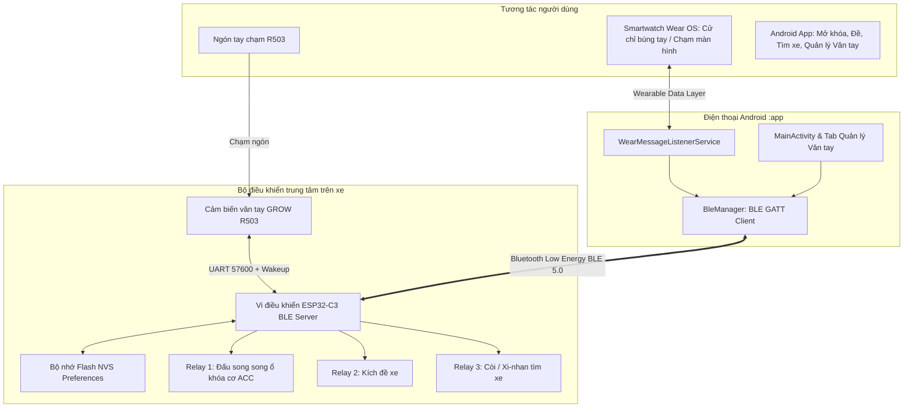

# TSMARTKEY - BỘ TÀI LIỆU GỐC HỆ THỐNG (MASTER SYSTEM DOCUMENT)

> **Dự án**: Hệ thống khóa xe thông minh điều khiển, mở khóa vân tay & tìm xe từ xa bằng App Điện thoại và Đồng hồ thông minh qua Bluetooth Low Energy (BLE) kết nối ESP32-C3.  
> **Phiên bản tài liệu**: 1.2.0 (Tích hợp Module RF 433MHz Tìm xe & Cơ chế an toàn Fail-Safe chuẩn công nghiệp)  
> **Cập nhật lần cuối**: 2026-09-13  

---

## MỤC LỤC
1. [Tổng quan dự án & Luồng hoạt động](#1-tổng-quan-dự-án--luồng-hoạt-động)
2. [Sơ đồ phần cứng ESP32-C3 & Đấu nối Relay, Cảm biến R503](#2-sơ-đồ-phần-cứng-esp32-c3--đấu-nối-relay-cảm-biến-r503)
3. [Cấu trúc cây thư mục toàn bộ dự án](#3-cấu-trúc-cây-thư-mục-toàn-bộ-dự-án)
4. [Kiến trúc giao thức truyền thông BLE & Phản hồi Feedback](#4-kiến-trúc-giao-thức-truyền-thông-ble--phản-hồi-feedback)
5. [Đặc tả Firmware ESP32-C3 (`firmware/esp32 c3`)](#5-đặc-tả-firmware-esp32-c3-firmwareesp32-c3)
6. [Đặc tả Ứng dụng Điện thoại Android (`:app`)](#6-đặc-tả-ứng-dụng-điện-thoại-android-app)
7. [Đặc tả Ứng dụng Đồng hồ Wear OS (`:wear`)](#7-đặc-tả-ứng-dụng-đồng-hồ-wear-os-wear)
8. [Hướng dẫn mở rộng & Phát triển tính năng mới](#8-hướng-dẫn-mở-rộng--phát-triển-tính-năng-mới)
9. [Kiến trúc An toàn Fail-Safe & Cơ chế Xử lý sự cố thực tế](#9-kiến-trúc-an-toàn-fail-safe--cơ-chế-xử-lý-sự-cố-thực-tế)

---

## 1. TỔNG QUAN DỰ ÁN & LUỒNG HOẠT ĐỘNG

### 1.1 Mục đích hệ thống
Tsmartkey là giải pháp Smartkey xe máy/xe điện thông minh toàn diện:
- **Mở khóa / Khóa xe bằng Vân tay một chạm (GROW R503)**:
  - Khi xe đang tắt: Chạm vân tay đúng $\rightarrow$ Mở khóa điện xe (Relay 1 ON), LED nháy xanh lá, bíp 1 tiếng. Bạn bấm nút đề trên xe để khởi động.
  - Khi xe đang bật: Chạm vân tay đúng $\rightarrow$ Tắt khóa điện xe (Relay 1 OFF), LED nháy đỏ, bíp 2 tiếng.
  - Quẹt sai: LED nháy đỏ cảnh báo, còi tít tít.
- **Mở khóa xe / Tìm xe / Đề xe từ xa qua BLE**: Điều khiển trực tiếp từ App Android hoặc Đồng hồ thông minh Wear OS.
- **Đấu nối an toàn (Song song ổ khóa cơ)**: Tiếp điểm Relay 1 đấu song song với ổ khóa cơ của xe máy. Khi cắm chìa khóa cơ vặn vẫn nổ máy bình thường (Fail-safe 100%).
- **Lưu trữ Flash NVS**: Tên vân tay (`name_<id>`), mã bảo mật (`master_key`) và trạng thái xe (`is_unlocked`) được lưu vĩnh viễn trên ESP32-C3, khôi phục tức thời khi mất điện nguồn.

### 1.2 Mô hình kiến trúc hệ thống



---

## 2. SƠ ĐỒ PHẦN CỨNG ESP32-C3 & ĐẤU NỐI RELAY, CẢM BIẾN R503

### 2.1 Bảng quy hoạch chân GPIO trên ESP32-C3 SuperMini (Golden Pinout - Chống xung đột Boot & Ngắt RTC)
| Chân ESP32-C3 | Nhóm chân | Chức năng | Đấu nối ngoại vi | Ghi chú kỹ thuật |
| :---: | :---: | :--- | :--- | :--- |
| **`GPIO 6`** | Digital Out | Output | **Relay 1 (Khóa điện ACC)** | Đấu song song ổ khóa cơ xe máy (Chân sạch, không giật xung lúc boot) |
| **`GPIO 7`** | Digital Out | Output | **Relay 2 (Đề nổ)** | Kích nút đề xe qua App / Watch (Chống tự đề lúc cắm bình) |
| **`GPIO 10`** | Digital Out | Output | **Relay 3 (Còi / Xi-nhan)** | Phát tín hiệu bíp tìm xe & cảnh báo chống trộm |
| **`GPIO 2`** | **RTC GPIO** | Input (Pullup) | **R503 WAKEUP (Dây Xanh dương)** | Đánh thức Deep Sleep (Active LOW: chạm = 0V, thức dậy trong 15ms) |
| **`GPIO 3`** | **RTC GPIO** | Input (Pullup) | **Cảm biến rung SW-420 (DO)** | Đánh thức Deep Sleep & Kích hoạt báo động chống trộm dắt xe (Active LOW) |
| **`GPIO 4`** | **RTC GPIO** | Input (Pullup) | **Module RF 433MHz (Chân VT)** | Đánh thức Deep Sleep qua Transistor NPN đảo mức (Active LOW khi bấm remote) |
| **`GPIO 0`** | RTC / UART | UART1 RX | **R503 TXD (Dây Vàng)** | Nhận dữ liệu hình ảnh & gói tin từ cảm biến R503 |
| **`GPIO 1`** | RTC / UART | UART1 TX | **R503 RXD (Dây Xanh lá)** | Truyền lệnh điều khiển đèn Aura & xác thực tới R503 |
| **`GPIO 8`** | Strapping | Output | **LED Onboard Super Mini** | Đèn LED trạng thái trên bo mạch (Active LOW). **Không nối dây ngoài** để tránh lỗi boot |
| **`GPIO 9`** | Strapping | - | **Nút BOOT Onboard** | **Để trống (NC)**. Đảm bảo nạp code và khởi động 100% không bị kẹt Download Mode |
| **`GPIO 5`** | RTC / ADC1 | Analog In | *(Dự phòng ADC đo bình 12V)* | Cầu phân áp 100k/20k đo dung lượng bình ắc quy |
| **`3.3V`** | Nguồn | DC 3.3V | **R503 VCC & Touch Power** | Cấp nguồn DC 3.3V ổn định từ Buck |
| **`GND`** | Nối đất | Mass chung | **R503 GND, SW-420, RF** | Mass chung của toàn bộ hệ thống |

### 2.2 Sơ đồ cáp 6 dây của cảm biến vân tay R503
```text
Cáp R503 MX1.0mm:
1. ĐỎ        : VCC (3.3V)
2. ĐEN       : GND
3. VÀNG      : TXD  ---> Nối vào GPIO 0 (ESP32-C3 RX1)
4. XANH LÁ   : RXD  ---> Nối vào GPIO 1 (ESP32-C3 TX1)
5. XANH DƯƠNG: WAKEUP -> Nối vào GPIO 2 (ESP32-C3 RTC ngắt chạm, Active LOW: chạm = 0V, nghỉ = 3.2V)
6. TRẮNG     : 3.3V Touch -> Nối vào 3.3V
```

### 2.3 Đặc tả kỹ thuật khởi tạo UART & Thư viện Cảm biến R503 trên ESP32-C3
```cpp
// Khởi tạo UART1 cho cảm biến R503
HardwareSerial r503Serial(1);
Adafruit_Fingerprint finger = Adafruit_Fingerprint((Stream*)&r503Serial);
```
- **Tại sao sử dụng `HardwareSerial r503Serial(1)`?**
  - ESP32-C3 chỉ có 2 bộ UART cứng: UART 0 và UART 1. Nhờ cờ cấu hình `-DARDUINO_USB_CDC_ON_BOOT=1` trong `platformio.ini`, cổng Serial debug đi qua USB CDC nội bộ, giải phóng hoàn toàn UART 1 cho GPIO 0 (RX) và GPIO 1 (TX).
- **Tại sao bắt buộc ép kiểu `(Stream*)&r503Serial`?**
  - Thư viện `Adafruit_Fingerprint` có 2 hàm khởi tạo: `(HardwareSerial*)` và `(Stream*)`.
  - Nếu truyền `&r503Serial` thông thường, thư viện sẽ gọi Constructor 1 (`hwSerial = hs`). Khi gọi hàm thư viện, nó sẽ vô tình kích hoạt `hwSerial->begin(baudrate)` làm reset chân RX/TX về mặc định (`-1, -1`), gây **mất kết nối phần cứng với R503**.
  - Ép kiểu sang `(Stream*)&r503Serial` buộc C++ sử dụng Constructor 2 (`mySerial = serial`). Cổng UART được xem như luồng dữ liệu byte trừu tượng, quyền cấu hình chân GPIO 0 và GPIO 1 thuộc toàn quyền của bạn.
- **Vòng lặp quét Baudrate an toàn (Failsafe Baud Scan)**:
  - Khi quét qua danh sách baudrate `{57600, 9600, 115200, 19200, 38400}`, mỗi lần thử thất bại phải gọi `r503Serial.end(); delay(20);` trước khi gọi `r503Serial.begin()` mới để reset sạch FIFO và ngắt UART của ESP32-C3, tránh treo vi điều khiển.

---

## 3. CẤU TRÚC CÂY THƯ MỤC TOÀN BỘ DỰ ÁN

```text
Tysmartkey/
├── PROJECT_MASTER_DOCUMENT.md          # [TÀI LIỆU NÀY] Tài liệu chuẩn hệ thống
├── README.md                           # Giới thiệu & điều hướng
├── firmware/                           # Firmware PlatformIO nạp cho vi điều khiển
│   └── esp32 c3/                       # Dự án ESP32-C3 PlatformIO
│       ├── platformio.ini              # Config board esp32-c3-devkitm-1, NimBLE, Adafruit FP
│       └── src/
│           ├── main.cpp                # Mã nguồn chính firmware ESP32-C3 + R503 + NimBLE
│           └── esp32_blynk.ino.bak     # Bản sao lưu mã nguồn cũ
│
└── APP Controlesp/                     # Dự án Android Studio (Multi-Module)
    ├── app/                            # MODULE 1: ỨNG DỤNG ĐIỆN THOẠI ANDROID
    │   ├── src/main/
    │   │   ├── AndroidManifest.xml     # Khai báo quyền Bluetooth, BLE, Service
    │   │   ├── java/com/example/control_esp/
    │   │   │   ├── MainActivity.kt               # Giao diện chính 4 Tab, quản lý vân tay
    │   │   │   ├── BleManager.kt                 # Quản lý quét & kết nối BLE GATT Server
    │   │   │   ├── BluetoothController.kt        # Dự phòng Bluetooth Classic
    │   │   │   └── WearMessageListenerService.kt # Dịch vụ cầu nối ngầm Wear OS <-> BLE
    │   │   └── res/
    │   │       ├── layout/
    │   │       │   ├── activity_main.xml         # Layout 4 tab (Điều khiển, Tìm xe, Vân tay, Cài đặt)
    │   │       │   └── item_fingerprint.xml      # Layout thẻ hiển thị từng vân tay
    │   │       ├── menu/bottom_nav_menu.xml      # 4 mục điều hướng
    │   │       └── drawable/ic_fingerprint.xml   # Icon vector vân tay
    │   └── build.gradle.kts
    │
    └── wear/                           # MODULE 2: ỨNG DỤNG ĐỒNG HỒ WEAR OS
        ├── src/main/java/com/example/control_esp/wear/
        │   └── MainActivity.kt         # Giao diện Compose Wear OS & Cảm biến búng tay đề máy
        └── build.gradle.kts
```

---

## 4. KIẾN TRÚC GIAO THỨC TRUYỀN THÔNG BLE & PHẢN HỒI FEEDBACK

### 4.1 Thông số BLE GATT Service & Characteristic
- **Tên thiết bị quảng bá (Device Name)**: `XE_tsmart_BLE`
- **Service UUID**: `0000ff01-0000-1000-8000-00805f9b34fb`
- **Characteristic UUID**: `0000ff02-0000-1000-8000-00805f9b34fb`
- **Properties**: `READ` | `WRITE` | `WRITE_NO_RESPONSE` | `NOTIFY`

### 4.2 Bảng mã lệnh (App $\rightarrow$ ESP32-C3)
Định dạng gói tin: `<SECRET_KEY>|<CMD>[|<PARAM1>|<PARAM2>]\n`

| Mã Lệnh (`cmd`) | Tham số (`params`) | Hành vi hệ thống |
| :--- | :--- | :--- |
| `1` | Không | **Mở khóa xe**: Đóng Relay 1 (ACC ON), lưu flash, LED xanh lá, bíp 1 tiếng. |
| `0` | Không | **Khóa xe**: Ngắt Relay 1 (ACC OFF), lưu flash, LED đỏ, bíp 2 tiếng. |
| `2` | Không | **Đề xe**: Kích Relay 2 trong 1.5s (chỉ kích hoạt khi xe đang mở khóa). |
| `3` | Không | **Tìm xe**: Kích Relay 3 (còi / đèn) trong 3.0s. |
| `9` | `<NEW_KEY>` | **Đổi mã bảo mật**: Lưu mã mới vào Flash NVS `safe_key`. |
| `FP_LIST` | Không | **Lấy danh sách vân tay**: ESP32 gửi danh sách ID và Tên qua các gói tin `FP_ITEM`. |
| `FP_ENROLL` | `<TÊN_NGÓN>` | **Thêm vân tay mới**: Bắt đầu quy trình lấy mẫu 2 bước, lưu tên vào Flash NVS. |
| `FP_DELETE` | `<ID>` | **Xóa vân tay**: Xóa template trong R503 và xóa tên trong Flash NVS. |
| `FP_RENAME` | `<ID>\|<TÊN_MỚI>`| **Đổi tên vân tay**: Cập nhật tên gợi nhớ mới trong Flash NVS. |
| `FP_CLEAR` | `CONFIRM` | **Xóa toàn bộ vân tay**: Xóa trắng bộ nhớ R503 và xóa database trong Flash NVS. |

### 4.3 Bảng phản hồi trạng thái từ ESP32 gửi lên App (`FB|<STATUS>`)
| Mã Trạng Thái | Ý nghĩa |
| :--- | :--- |
| `DA_MO_KHOA` | Xe đã mở khóa nguồn điện thành công |
| `DA_KHOA_XE` | Xe đã khóa nguồn điện thành công |
| `DA_DE_MAY` | Đã kích relay đề nổ máy |
| `DA_TIM_XE` | Đang phát tín hiệu tìm xe |
| `DA_DOI_KEY` | Đổi mã khóa bảo mật thành công |
| `LOI_SAI_KEY` | Sai mã bảo mật |
| `LOI_CHUA_MO_KHOA`| Xe chưa mở khóa điện mà yêu cầu đề |
| `FP_LIST_START` | Bắt đầu truyền danh sách vân tay |
| `FP_ITEM\|<ID>\|<NAME>` | Dữ liệu từng vân tay đã đăng ký |
| `FP_LIST_END` | Hoàn tất truyền danh sách vân tay |
| `FP_ENROLL_STEP_1\|<ID>` | Vui lòng đặt ngón tay lên cảm biến (Lần 1) |
| `FP_ENROLL_STEP_2\|<ID>` | Nhấc ngón tay ra và đặt lại lần 2 |
| `FP_ENROLL_OK\|<ID>\|<NAME>`| Thêm vân tay thành công |
| `FP_ENROLL_FAILED\|<LÝ_DO>` | Thất bại (Timeout, mờ, không khớp) |
| `FP_DELETE_OK\|<ID>` | Xóa vân tay thành công |
| `FP_RENAME_OK\|<ID>\|<NAME>`| Đổi tên vân tay thành công |
| `FP_CLEAR_OK` | Đã xóa toàn bộ vân tay |
| `FP_MATCHED\|<ID>\|<NAME>` | Quẹt vân tay đúng $\rightarrow$ Đổi trạng thái Bật/Tắt xe thành công |
| `FP_NOT_MATCH` | Cảnh báo: Quẹt vân tay không hợp lệ |

---

## 5. ĐẶC TẢ FIRMWARE ESP32-C3 (`firmware/esp32 c3`)

- **Cấu hình PlatformIO (`platformio.ini`)**:
  - `board = esp32-c3-devkitm-1`
  - `framework = arduino`
  - `build_flags = -DARDUINO_USB_MODE=1 -DARDUINO_USB_CDC_ON_BOOT=1`
  - `lib_deps = h2zero/NimBLE-Arduino, adafruit/Adafruit Fingerprint Sensor Library, Preferences`
- **Mã nguồn chính (`src/main.cpp`)**:
  - **Khởi tạo R503 an toàn**: Sử dụng `HardwareSerial r503Serial(1);` kết hợp ép kiểu `(Stream*)&r503Serial` vào `Adafruit_Fingerprint` để bảo vệ cấu hình chân GPIO 0 (RX) và GPIO 1 (TX).
  - **Quét Baudrate tự phục hồi (Baud Auto-Scan)**: Thử nghiệm tuần tự qua `{57600, 9600, 115200, 19200, 38400}`, chèn `r503Serial.end(); delay(20);` khi chuyển đổi để giải phóng buffer FIFO UART, chống treo chip.
  - **Quản lý BLE qua NimBLE**: Giữ mức phát sóng cực đại `ESP_PWR_LVL_P9`, xử lý kết nối, ngắt kết nối và cơ chế Fail-Safe khi mất kết nối.
  - **Quản lý Flash NVS**: Sử dụng thư viện `Preferences` lưu trữ vĩnh viễn trạng thái khóa xe `is_unlocked`, mật khẩu bảo mật `master_key`, và danh bạ tên vân tay.
  - **Kiểm tra biên dịch**: Đã biên dịch PlatformIO CLI thành công 100% (RAM: 7.4%, Flash: 42.5%, mã nhị phân `firmware.bin` sẵn sàng nạp).

---

## 6. ĐẶC TẢ GIAO DIỆN CHÍNH THỨC: MẪU 1 (CYBER COMMAND - LUXURY GOLD EDITION)

Thiết kế giao diện chính thức của hệ sinh thái TsmartKey được chuẩn hóa theo **Mẫu 1: Cyber Command Center** kết hợp bộ nhận diện **Luxury Gold & Obsidian**:

### 6.1 Bảng Màu & Ngôn Ngữ Thiết Kế (Design System Tokens)
- **Màu chủ đạo (Primary Gold)**: Vàng Champagne (`#d4af37`), Vàng Hổ Phách Thể Thao (`#f59e0b`), Ánh kim Gold Gradient (`linear-gradient(135deg, #ffd700, #b8860b)`).
- **Mặt nền & Khối viền (Surfaces & Glassmorphism)**: Đen Thạch Anh Obsidian sâu (`#060608`), khung Titan cao cấp (`#161620`), viền ánh kim phản chiếu sang trọng (`rgba(212, 175, 55, 0.22)`).
- **Haptic & Audio Feedback**: Phản hồi âm thanh điện tử tần số kép (440Hz - 1200Hz) mô phỏng tiếng còi, tiếng đề xe và xác nhận thao tác chuẩn xác.

### 6.2 Chi Tiết 4 Tab Chức Năng Trên Điện Thoại
1. **Tab 1: Điều khiển (Cockpit)**:
   - **Nút tròn Hero Push-Start 3D Vàng Hoàng Gia 154px**: Nằm ở vị trí trọng tâm. Khi chạm kích hoạt nguồn ACC (Relay 1), vòng hào quang Neon bung tỏa hiệu ứng sóng ánh sáng Gold đa tầng rực rỡ.
   - **Digital-Twin Xe Honda SH 150i**: Đèn pha LED vàng ấm tự động bật sáng khi kích hoạt nguồn, hiệu ứng rung cơ học và khói pô khi bấm nổ máy (Relay 2), còi nháy xi-nhan khi tìm xe.
   - **Tính năng Đổi Tên Xe Linh Hoạt**: Chạm vào biểu tượng ✏️ để mở Modal cấu hình tên xe (`Honda SH 150i`, `Honda SH 350i`, `Air Blade 160`, `Yamaha NVX 155`, `Vespa GTS 300`, `Vario 160`, `Exciter 155`...) và biển số xe, đồng bộ tức thì trên toàn bộ app.
2. **Tab 2: Tìm xe (Radar 360° & Finder)**:
   - **Radar 360° cự ly thời gian thực**: Quét khoảng cách BLE RSSI theo các nấc 1.5m, 3.5m, 8.0m, 15m với điểm Blip phản hồi động.
   - **Đèn Dẫn Đường 30s**: Giữ đèn pha sáng trong 30 giây khi đỗ xe trong hầm tối.
   - **Ghim vị trí đỗ xe**: Lưu ghi chú hầm đỗ xe (VD: *Hầm B2 - Cột F08*).
3. **Tab 3: Quản lý Vân tay (R503 Biometric Hub)**:
   - **Mô phỏng cảm biến R503**: Vòng LED tròn Aura thở đa sắc, hiển thị logic chân WAKEUP (Active LOW: chạm = 0V, nghỉ = 3.2V) và tốc độ UART 57600 bps.
   - **Nút ⚡ Quẹt thử trực tiếp**: Cho phép quẹt thử từng ngón tay ngay trên giao diện để kiểm tra tỷ lệ khớp 99.4% và tự kích hoạt mở xe.
   - **Quy trình nạp 3 bước Failsafe**: Có tia quét Laser mô phỏng, nút hủy an toàn `FP_CANCEL`.
4. **Tab 4: Cài đặt & Hồ sơ Garage (Garage Profile & Security)**:
   - Thẻ hồ sơ phương tiện Garage Profile quản lý thông tin xe.
   - **Chuẩn An Toàn Failsafe Ô Tô (Critical)**: Duy trì Relay 1 khi xe đang nổ máy di chuyển dù mất kết nối BLE hay điện thoại hết pin.
   - Cấu hình bán kính nhận diện tự mở xe PKE (1.0m - 5.0m) và chia sẻ chìa khóa mượn xe tạm thời (Valet Key OTP 60 phút).

- **Dịch vụ cầu nối ngầm (`WearMessageListenerService.kt`)**: Tự động nhận lệnh từ Smartwatch qua Google Wearable Data Layer và chuyển tiếp qua `BleManager`.

---

## 7. ĐẶC TẢ ỨNG DỤNG ĐỒNG HỒ WEAR OS (`:wear`)

- Phát triển bằng **Jetpack Compose for Wear OS**:
  - Màn hình tròn toàn màn hình, nút chạm đổi màu theo trạng thái xe.
  - Nhận diện cử chỉ **búng tay (Pinch)** bằng cảm biến gia tốc `Sensor.TYPE_LINEAR_ACCELERATION` (ngưỡng gia tốc $> 18\text{ m/s}^2$) để kích hoạt đề nổ máy từ đồng hồ.
  - Tự động hủy đăng ký cảm biến sau 2 lần đề nổ để tiết kiệm pin và đảm bảo an toàn khi đang lái xe.

---

## 8. HƯỚNG DẪN MỞ RỘNG & PHÁT TRIỂN TÍNH NĂNG MỚI

1. **Tính năng Tự động mở khóa khi lại gần (Smart Proximity Unlock)**:
   - Sử dụng hàm đo RSSI của BLE trong `BleManager.kt`. Khi RSSI > -65 dBm (khoảng cách 1-2m), tự động phát lệnh `1`. Khi RSSI < -85 dBm hoặc mất kết nối, tự động phát lệnh `0`.
2. **Bảo mật nâng cao (HMAC / Rolling Code)**:
   - Trong trường hợp muốn nâng cấp bảo mật chống bắt gói tin BLE, có thể tích hợp mã hóa thời gian thực (Timestamp + HMAC-SHA256) giữa Android App và ESP32-C3.

---

## 9. KIẾN TRÚC AN TOÀN FAIL-SAFE & CƠ CHẾ XỬ LÝ SỰ CỐ THỰC TẾ

### 9.1 Cơ chế Xử lý khi Xe đang chạy mà Điện thoại Mất kết nối (BLE Disconnect)
> **Nguyên tắc sống còn**: Tuyệt đối không được ngắt nguồn ACC/Relay 1 khi xe đang lưu thông ngoài đường nhằm đảm bảo an toàn tính mạng người lái.

```text
[ XE ĐANG MỞ KHÓA (isUnlocked = true) ]
                     │
         Mất kết nối Bluetooth BLE!
         (Hết pin / Rớt điện thoại)
                     │
                     ▼
  ┌─────────────────────────────────────────────────────────┐
  │  KHÔNG THAY ĐỔI TRẠNG THÁI RELAY 1 (GIỮ NGUYÊN NGUỒN)   │
  │  Xe vẫn tiếp tục nổ máy chạy bình thường 100%!           │
  └─────────────────────────────────────────────────────────┘
                     │
       Phát tín hiệu Cảnh báo cho tài xế:
       - Còi bíp nhẹ 2 tiếng cảnh báo
       - Đèn LED R503 nháy thở màu Tím/Vàng (Báo mất Bluetooth)
                     │
                     ▼
         Khi tài xế dừng xe đến nơi:
         - Chủ động chạm vân tay vào R503 để TẮT XE.
         - Hoặc vặn chìa cơ về OFF.
                     │
                     ▼
  ┌─────────────────────────────────────────────────────────┐
  │  XE CHUYỂN SANG TRẠNG THÁI KHÓA HOÀN TOÀN (LOCKED)       │
  │  Sau khi đã tắt, nếu không có vân tay hợp lệ hoặc        │
  │  không có chìa cơ, kẻ gian KHÔNG THỂ đề nổ lại!          │
  └─────────────────────────────────────────────────────────┘
```

### 9.2 Đa tầng dự phòng khi Điện thoại hết pin / Quên máy
1. **Tầng 1 - Cảm biến vân tay R503**: Hoạt động hoàn toàn Offline và xử lý cục bộ trên ESP32. Chỉ cần chạm ngón tay là mở/khóa xe trong 0.5s mà không phụ thuộc bất kỳ thiết bị di động nào.
2. **Tầng 2 - Ổ khóa cơ vật lý (Đấu song song)**: Tiếp điểm thường mở của Relay 1 đấu song song trực tiếp với 2 dây ổ khóa cơ. Khi vặn chìa khóa cơ zin, điện bình ắc quy nối tắt cấp thẳng cho dây ACC (100% Hardware Override), không phụ thuộc vào tình trạng hoạt động của vi điều khiển ESP32.
3. **Tầng 3 - Module RF 433MHz Chỉ Dùng Tìm Xe (Locate-Only)**:
   - Module thu RF kết nối trực tiếp vào `GPIO 7`.
   - Bấm nút remote sẽ kích hoạt 3 nhịp chớp đèn xi-nhan và còi bíp ngắn.
   - **Chính sách an ninh**: Tuyệt đối không mở khóa qua RF để triệt tiêu hoàn toàn nguy cơ bị sao chép mã sóng (Replay Attack) hoặc bị cấn nút trong túi quần.

---

## 10. TỔNG HỢP KIỂM TOÁN VÀ CÁC ĐIỂM VÁ LOGIC ĐÃ HOÀN TẤT (AUDIT FIX LOG)

| Kịch bản | Vị trí file | Điểm sai logic thực tế | Giải pháp đã khắc phục 100% |
| :--- | :--- | :--- | :--- |
| **KB 1 (Khóa bằng vân tay)** | [`MainActivity.kt`](file:///d:/Documents/PlatformIO/Tysmartkey/APP%20Controlesp/app/src/main/java/com/example/control_esp/MainActivity.kt) | Nhận `FP_MATCHED|` khi xe đang bật bị ghi sai là "Mở khóa xe" | Kiểm tra biến `isOn`: Nếu `isOn == true` $\rightarrow$ *"Mở khóa bằng vân tay"*, nếu `isOn == false` $\rightarrow$ *"Khóa xe bằng vân tay"*. |
| **KB 2 (Chết vòng reconnect)** | [`MainActivity.kt`](file:///d:/Documents/PlatformIO/Tysmartkey/APP%20Controlesp/app/src/main/java/com/example/control_esp/MainActivity.kt) | Xe ngoài vùng sóng lần đầu fail $\rightarrow$ ngắt cơ chế reconnect vĩnh viễn | Trong `updateConnectionUI(false)`, nếu `isAutoConnectEnabled && !isManualDisconnect` $\rightarrow$ tự động lên lịch thử lại sau 4s. |
| **KB 3 (Đề xe ma/ảo)** | [`MainActivity.kt`](file:///d:/Documents/PlatformIO/Tysmartkey/APP%20Controlesp/app/src/main/java/com/example/control_esp/MainActivity.kt) | Bấm nút mở xe tự hẹn giờ 3s đề nổ dù xe chưa bật điện ACC | Loại bỏ hẹn giờ mù quáng ở `btnToggle`. **CHỈ** kích hoạt bộ đếm đề nổ khi xe gửi phản hồi `DA_MO_KHOA` về (`wasOff == true`). |
| **KB 4 (Khóa key rỗng)** | [`BleManager.kt`](file:///d:/Documents/PlatformIO/Tysmartkey/APP%20Controlesp/app/src/main/java/com/example/control_esp/BleManager.kt) & [`MainActivity.kt`](file:///d:/Documents/PlatformIO/Tysmartkey/APP%20Controlesp/app/src/main/java/com/example/control_esp/MainActivity.kt) | Cài đặt app lần đầu `SECRET_KEY` rỗng gửi `NO_KEY|` khiến ESP32 từ chối | Đặt fallback mặc định của SharedPreferences và biến `SECRET_KEY = "271000"`. |
| **KB 5 (Wear OS ngầm)** | [`WearMessageListenerService.kt`](file:///d:/Documents/PlatformIO/Tysmartkey/APP%20Controlesp/app/src/main/java/com/example/control_esp/WearMessageListenerService.kt) | Chạy ngầm đọc `IS_BLE` mặc định là `false` cố kết nối Classic BT | Đặt `IS_BLE` mặc định là `true` và `secretKey = "271000"`, gửi trực tiếp qua BLE 5.0. |
| **KB 6 (Tràn lịch sử ảo)** | [`MainActivity.kt`](file:///d:/Documents/PlatformIO/Tysmartkey/APP%20Controlesp/app/src/main/java/com/example/control_esp/MainActivity.kt) | Xe chập chờn BLE reconnect gửi `DA_MO_KHOA` ghi thêm nhiều dòng mở khóa | Kiểm tra `val wasOff = !isOn`. Chỉ ghi lịch sử khi xe chuyển trạng thái từ TẮT $\rightarrow$ MỞ. |
| **KB 7 (Dội vòng lặp Switch)** | [`MainActivity.kt`](file:///d:/Documents/PlatformIO/Tysmartkey/APP%20Controlesp/app/src/main/java/com/example/control_esp/MainActivity.kt) | Bật Switch Tab 1 kích hoạt Tab 2 và dội ngược lại gây lặp `saveSettings()` | Bổ sung điều kiện kiểm tra `if (cbOther?.isChecked != isChecked)` trước khi gán. |
| **KB 8 (Hồ sơ Garage xe)** | [`MainActivity.kt`](file:///d:/Documents/PlatformIO/Tysmartkey/APP%20Controlesp/app/src/main/java/com/example/control_esp/MainActivity.kt) | Tên xe chỉ hiển thị tên BLE mặc định, chưa có hồ sơ Garage cá nhân | Thêm SharedPreferences `"VEHICLE_NAME"` (mặc định `"Honda SH 150i"`), cho phép bấm vào Header để đổi tên gợi nhớ xe. |
| **Bổ sung (Chuẩn Honda SH)** | [`main.cpp`](file:///d:/Documents/PlatformIO/Tysmartkey/firmware/esp32%20c3/src/main.cpp) | Relay 3 (Còi/Đèn) tự kích hoạt gây hú còi và nháy đèn khi bật tắt xe | **Phương Án 1 (Silent ACC):** Loại bỏ hoàn toàn `beep()` trong `setVehicleUnlock()` và `setup()`. Bật/Tắt xe êm ái qua Relay 1 (ACC) và vòng LED R503. Relay 3 **CHỈ DÀNH RIÊNG CHO:** (1) Tìm xe trên App/Remote RF (`triggerLocate()`); (2) Quẹt sai vân tay 3 lần liên tiếp (`beep(6, 120)` - Báo động chống trộm). |

