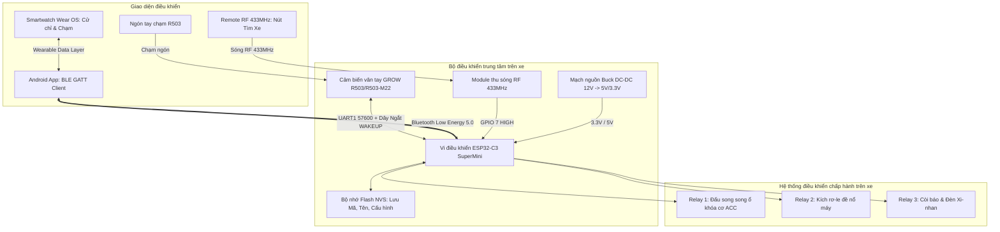

# TSMARTKEY - HỆ THỐNG SMARTKEY XE MÁY THÔNG MINH QUA BLE & VÂN TAY R503

> **Phiên bản**: v2.1.0  
> **Nền tảng**: ESP32-C3 SuperMini • Cảm biến quang học Grow R503/R503-M22 • Android App • Smartwatch Wear OS  
> **Kiến trúc an toàn**: Chuẩn Fail-Safe công nghiệp ô tô/xe máy — Đấu song song ổ khóa cơ, bảo toàn 100% chức năng xe nguyên bản.

---

## 📑 MỤC LỤC
1. [Giới thiệu tổng quan dự án](#1-giới-thiệu-tổng-quan-dự-án)
2. [Sơ đồ khối hệ thống & Nguyên lý hoạt động](#2-sơ-đồ-khối-hệ-thống--nguyên-lý-hoạt-động)
3. [Bảng quy hoạch Pinout chân kết nối ESP32-C3](#3-bảng-quy-hoạch-pinout-chân-kết-nối-esp32-c3)
4. [Sơ đồ đấu nối dây chi tiết (Wiring Diagram)](#4-sơ-đồ-đấu-nối-dây-chi-tiết-wiring-diagram)
   - [4.1 Đấu nối Cảm biến vân tay R503 (Cáp 6 dây)](#41-đấu-nối-cảm-biến-vân-tay-r503-cáp-6-dây)
   - [4.2 Đấu nối Cụm 3 Relay vào hệ thống điện xe](#42-đấu-nối-cụm-3-relay-vào-hệ-thống-điện-xe)
   - [4.3 Đấu nối Module RF 433MHz (Tìm xe bãi)](#43-đấu-nối-module-rf-433mhz-tìm-xe-bãi)
   - [4.4 Đấu nối Mạch nguồn hạ áp cách ly (12V -> 5V/3.3V)](#44-đấu-nối-mạch-nguồn-hạ-áp-cách-ly-12v---5v33v)
5. [Hướng dẫn lắp đặt trên xe từng bước](#5-hướng-dẫn-lắp-đặt-trên-xe-từng-bước)
6. [Các tính năng công nghệ nổi bật](#6-các-tính-năng-công-nghệ-nổi-bật)
7. [Hướng dẫn nạp Firmware & Cài đặt Ứng dụng](#7-hướng-dẫn-nạp-firmware--cài-đặt-ứng-dụng)
8. [Cẩm nang xử lý sự cố thực tế (Troubleshooting)](#8-cẩm-nang-xử-lý-sự-cố-thực-tế-troubleshooting)

---

## 1. GIỚI THIỆU TỔNG QUAN DỰ ÁN

**TSmartKey** là giải pháp nâng cấp hệ thống khóa xe thông minh toàn diện dành cho xe máy (xăng/điện), thay thế hoặc song hành cùng chìa khóa cơ truyền thống với các phương thức xác thực hiện đại:

- 👆 **Vân tay sinh trắc học một chạm**: Sử dụng mắt đọc quang học cao cấp **Grow R503/R503-M22** (độ phân giải 508 DPI, lăng kính thủy tinh chống trầy IP65). Chạm ngón tay để bật nguồn xe tức thì trong 0.3s; chạm lại để tắt khóa.
- 📱 **Điều khiển thông minh qua Bluetooth (BLE)**: Đóng/mở khóa xe, đề nổ từ xa, tìm xe trong bãi xe ngầm thông qua App Android chuyên nghiệp.
- ⌚ **Tích hợp đồng hồ thông minh (Wear OS)**: Hỗ trợ điều khiển trực tiếp trên cổ tay, nhận diện cử chỉ vung tay/búng ngón tay để đề máy xe.
- 🌈 **Đèn hào quang RGB 360° (Aura RGB)**: Bánh xe màu cảm ứng trên App cho phép tùy biến 7 màu sắc phần cứng và 4 hiệu ứng (Thở, Sáng, Nhấp nháy, Tắt) tương ứng với 4 trạng thái xe.
- ☔ **Thuật toán chống nước mưa (Anti-Rain Protocol)**: Tự động phát hiện giọt nước đọng trên lăng kính, lọc nhiễu chạm ảo, tạm khóa chống hao bình và chống báo động giả khi trời mưa bão.
- 🛡️ **An toàn Fail-Safe tuyệt đối**: Tiếp điểm Relay 1 đấu song song với ổ khóa cơ. Khi vi điều khiển mất nguồn, hỏng bo mạch hoặc rút bình ắc quy, bạn **vẫn cắm chìa khóa cơ vào vặn nổ máy và di chuyển bình thường**.

---

## 2. SƠ ĐỒ KHỐI HỆ THỐNG & NGUYÊN LÝ HOẠT ĐỘNG



---

## 3. BẢNG QUY HOẠCH PINOUT CHÂN KẾT NỐI ESP32-C3

Dự án sử dụng bo mạch **ESP32-C3 SuperMini** (vi kiến trúc RISC-V 32-bit, tích hợp sẵn Wi-Fi & BLE 5.0). Sơ đồ chân kết nối được quy hoạch chuẩn xác:

| Chân ESP32-C3 | Chế độ | Thiết bị ngoại vi kết nối | Mô tả chức năng kỹ thuật |
| :---: | :---: | :--- | :--- |
| **`GPIO 0`** | `UART1 RX` | **Dây VÀNG (TXD)** của R503 | Nhận gói tin dữ liệu hình ảnh, phản hồi ACK từ cảm biến |
| **`GPIO 1`** | `UART1 TX` | **Dây XANH LÁ (RXD)** của R503 | Truyền lệnh điều khiển Opcode (0x01, 0x35, 0x04...) sang R503 |
| **`GPIO 3`** | `Input Pullup` | **Dây XANH DƯƠNG (WAKEUP)** của R503 | Tín hiệu ngắt cảm ứng chạm (Active LOW: không chạm = 3.2V, có chạm = 0V) |
| **`GPIO 4`** | `Output` | **Relay 1 (Khóa điện ACC)** | Đóng/cắt nguồn điện chính ổ khóa xe (Mở máy / Tắt máy) |
| **`GPIO 5`** | `Output` | **Relay 2 (Đề nổ Start)** | Kích rơ-le đề xe trong 800ms khi ra lệnh từ App/Watch |
| **`GPIO 6`** | `Output` | **Relay 3 (Còi & Xi-nhan)** | Phát chuỗi âm thanh bíp và nháy đèn khi tìm xe / báo động |
| **`GPIO 7`** | `Input Pulldown` | **Chân VT / D0 của Module RF 433** | Nhận tín hiệu bấm Remote tìm xe (Chỉ tìm xe, không mở khóa) |
| **`GPIO 2`** | `Input Pullup` | Dự phòng ngắt WAKEUP | Giữ điện trở kéo cao nội bộ chống kích hoạt nhầm |
| **`3.3V`** | `Nguồn OUT` | **Dây ĐỎ (VCC)** & **Dây TRẮNG (Touch)** | Cấp nguồn nuôi vi xử lý quang học và mạch cảm ứng R503 |
| **`GND`** | `Nối đất` | **Dây ĐEN (GND)** của R503 & Relay | Nối mass chung toàn bộ hệ thống xe |

> [!IMPORTANT]
> **Quy tắc phân chia UART trên ESP32-C3**:  
> Cổng `UART0` được hệ điều hành dành riêng cho nạp code và Serial Monitor. Cảm biến R503 **bắt buộc chạy trên `HardwareSerial r503Serial(1)`** với chân remap RX=`GPIO 0` và TX=`GPIO 1`. Không bao giờ khai báo `HardwareSerial(0)` để tránh xung đột baudrate làm mất gói tin `0xEF 0x01`.

---

## 4. SƠ ĐỒ ĐẤU NỐI DÂY CHI TIẾT (WIRING DIAGRAM)

### 4.1 Đấu nối Cảm biến vân tay R503 (Cáp 6 dây chuẩn MX1.0mm)

Cảm biến R503 sử dụng cáp dẹt 6 sợi có mã màu tiêu chuẩn từ nhà sản xuất GROW:

```text
                  CẢM BIẾN VÂN TAY R503                  BO MẠCH ESP32-C3 SUPERMINI
             ┌─────────────────────────────┐             ┌─────────────────────────┐
(Dây 1 - Đỏ) │ 1. VCC (Nguồn nuôi quang học)├────────────┤ 3.3V                    │
(Dây 2 - Đen)│ 2. GND (Nối mass)           ├────────────┤ GND                     │
(Dây 3 - Vàng│ 3. TXD (Dữ liệu truyền đi)  ├────────────┤ GPIO 0 (Chân RX1)       │
(Dây 4 - Lá) │ 4. RXD (Dữ liệu nhận vào)   ├────────────┤ GPIO 1 (Chân TX1)       │
(Dây 5 - Lam)│ 5. WAKEUP (Ngắt chạm tay)   ├────────────┤ GPIO 3 (Kéo INPUT_PULLUP)
(Dây 6 -Trắng│ 6. 3.3V Touch (Nguồn cảm ứng├────────────┤ 3.3V (Chập chung dây 1) │
             └─────────────────────────────┘             └─────────────────────────┘
```

> [!WARNING]
> **Chú ý đấu chéo dây UART**:
> - Dây **Vàng (TXD)** của R503 là chiều **phát** $\rightarrow$ phải cắm vào chân **`GPIO 0` (RX)** của ESP32.
> - Dây **Xanh lá (RXD)** của R503 là chiều **nhận** $\leftarrow$ phải cắm vào chân **`GPIO 1` (TX)** của ESP32.
> - Nếu cắm ngược Vàng $\rightarrow$ GPIO 1 và Xanh lá $\rightarrow$ GPIO 0, cả 2 bên cùng phát vào nhau, ESP32 sẽ báo lỗi `Không tìm thấy Header 0xEF 0x01`.

---

### 4.2 Đấu nối Cụm 3 Relay vào hệ thống điện xe

Sử dụng module Relay cách ly quang (Optocoupler 5V hoặc 3.3V kích mức LOW/HIGH):

```text
                    BỘ TIẾP ĐIỂM RELAY                    ĐIỆN XE MÁY (HONDA/YAMAHA)
             ┌─────────────────────────────┐             ┌─────────────────────────┐
(GPIO 4) ───►│ Relay 1: Thường Mở (COM - NO)├────────────┤ Đấu song song 2 dây     │
             │                              │             │ ổ khóa cơ ACC xe máy    │
             ├─────────────────────────────┤             ├─────────────────────────┤
(GPIO 5) ───►│ Relay 2: Thường Mở (COM - NO)├────────────┤ Đấu song song 2 tiếp    │
             │                              │             │ điểm nút bấm đề nổ xe   │
             ├─────────────────────────────┤             ├─────────────────────────┤
(GPIO 6) ───►│ Relay 3: Thường Mở (COM - NO)├────────────┤ Đấu vào còi xe (Buzzer) │
             │                              │             │ hoặc dây cấp đèn Xi-nhan│
             └─────────────────────────────┘             └─────────────────────────┘
```

- **Relay 1 (Nguồn điện khóa ACC - Cực kỳ an toàn)**:
  - 2 đầu ra `COM` và `NO` của Relay 1 đấu song song trực tiếp vào 2 dây của ổ khóa cơ xe máy.
  - Khi xe khóa: Relay 1 ngắt. Bạn cắm chìa khóa cơ vặn bật $\rightarrow$ Ổ khóa cơ dẫn điện nổ máy bình thường.
  - Khi mở bằng vân tay/App: Relay 1 đóng lại $\rightarrow$ Cấp nguồn điện xe y như khi đã vặn chìa khóa cơ.
- **Relay 2 (Nút đề máy)**:
  - Tiếp điểm đấu song song với công tắc bấm đề bên tay lái.
  - Khi bấm "Đề xe" trên điện thoại hoặc đồng hồ, Relay 2 nhấp đóng trong **800ms** rồi nhả ra.
- **Relay 3 (Tìm xe / Báo động)**:
  - Đấu vào còi 12V hoặc kích dương vào dây đèn xi-nhan hai bên qua diode chống ngược.

---

### 4.3 Đấu nối Module RF 433MHz (Tìm xe bãi)

Dự án tích hợp module thu sóng RF 433MHz (loại học lệnh EV1527 / PT2262) để tìm xe bãi tầm xa 30 - 50m:

```text
       MODULE THU RF 433MHz                           ESP32-C3 SUPERMINI
  ┌─────────────────────────────┐                      ┌─────────────────┐
  │ VCC                         ├──────────────────────┤ 5V hoặc 3.3V    │
  │ GND                         ├──────────────────────┤ GND             │
  │ D0 / VT (Tín hiệu bấm nút)  ├──────────────────────┤ GPIO 7 (PULLDOWN│
  └─────────────────────────────┘                      └─────────────────┘
```
> [!NOTE]
> **Nguyên tắc an toàn phòng chống mã cuốn / hack sóng RF**:  
> Tín hiệu RF **chỉ được phép kích hoạt chuỗi bíp tìm xe trên Relay 3**, tuyệt đối **không bao giờ cho phép mở khóa xe (Relay 1)** qua sóng RF 433MHz để tránh kẻ gian dùng máy dò sóng mở trộm xe.

---

### 4.4 Đấu nối Mạch nguồn hạ áp cách ly (12V -> 5V/3.3V)

Điện áp trên bình ắc quy xe máy dao động từ **11.8V (khi nghỉ)** đến **14.8V (khi nổ máy sạc bình)** kèm gai nhiễu điện áp cao từ mobin sườn và củ đề:

```text
 ẮC QUY XE MÁY (12V DC)                     MẠCH BUCK HẠ ÁP LM2596 / MP1584                  ESP32 & CẢM BIẾN
 ┌──────────────────────┐                   ┌────────────────────────────────┐                ┌────────────────┐
 │ Cực (+) Bình (12V)   ├──[Cầu chì 2A]────►│ IN (+)                  OUT (+)├──── 5.0V ─────►│ Chân 5V ESP32  │
 │                      │                   │                                │                │ Chân VCC Relay │
 │ Cực (-) Bình (Mass)  ├──────────────────►│ IN (-)                  OUT (-)├─── GND Mass ──►│ GND chung      │
 └──────────────────────┘                   └────────────────────────────────┘                └────────────────┘
```
- Sử dụng module hạ áp xung Buck DC-DC hiệu suất cao (**MP1584EN** hoặc **LM2596** có tụ lọc nhiễu 35V).
- Bắt buộc gắn thêm **cầu chì ống 2A** sát cọc bình ắc quy để bảo vệ chống chập cháy đường dây.
- Mức tiêu thụ dòng điện khi khóa xe: ESP32-C3 tắt LED R503, dòng tiêu thụ chỉ **~15mA**, an toàn cho bình ắc quy ngay cả khi đỗ xe 2-3 tuần không đi.

---

## 5. HƯỚNG DẪN LẮP ĐẶT TRÊN XE TỪNG BƯỚC

### Bước 1: Khoét lỗ & Gắn cảm biến R503
1. Chọn vị trí gắn cảm biến R503 trên bửng nhựa xe, yếm xe hoặc gần ổ khóa sao cho thuận tay chạm ngón cái hoặc ngón trỏ.
2. Dùng mũi khoét lỗ tròn đường kính **22mm** (đối với bản R503-M22) hoặc **25mm** (đối với bản R503 ren vặn).
3. Đút cảm biến qua lỗ, luồn gioăng cao su chống nước đi kèm và siết chặt đai ốc lục giác phía sau.

### Bước 2: Đấu nối cụm dây vào xe
1. Xác định 2 dây phía sau ổ khóa cơ bằng đồng hồ vạn năng (1 dây Dương 12V trước ổ khóa và 1 dây Dương 12V sau ổ khóa khi vặn chìa).
2. Tách vỏ dây và hàn nối 2 tiếp điểm `COM` và `NO` của **Relay 1** song song vào 2 dây này, bọc co nhiệt cách điện kỹ càng.
3. Câu mass sườn xe vào chân `GND` của nguồn Buck và ESP32.

### Bước 3: Kiểm tra thông mạch & Nạp chương trình
1. Chưa vội đóng dàn áo nhựa của xe.
2. Bật khóa cơ $\rightarrow$ Kiểm tra còi và đèn táp-lô sáng bình thường.
3. Tắt khóa cơ, cắm nguồn mạch Smartkey $\rightarrow$ Cảm biến R503 nháy sáng xanh xác nhận khởi động.
4. Mở ứng dụng Android $\rightarrow$ Kết nối BLE $\rightarrow$ Đổi Secret Key mặc định (`271000`) thành mã bí mật của riêng bạn.
5. Thử nghiệm chức năng thêm vân tay và chạm mở khóa. Khi hệ thống vận hành trơn tru 100%, dùng băng keo vải cách điện cố định gọn gàng vào khung sườn xe.

---

## 6. CÁC TÍNH NĂNG CÔNG NGHỆ NỔI BẬT

### 🎨 Bánh xe màu sắc RGB 360° (Aura RGB LED)
- Ứng dụng Android tích hợp vòng bánh xe màu quang phổ 360 độ tương tác cảm ứng trực tiếp.
- Hỗ trợ đầy đủ **7 màu sắc phần cứng** của vi điều khiển R503:
  - 🔴 Đỏ (Sport Red) • 🟡 Vàng (Solar Gold) • 🟢 Xanh Lá (Emerald) • 🐬 Xanh Ngọc (Cyan)
  - 🔵 Xanh Dương (Ocean) • 🟣 Tím (Cyberpunk) • ⚪ Trắng (Pure White)
- Cấu hình độc lập cho **4 sự kiện trạng thái xe**:
  1. *Khi Xe Bật Khóa*: Thở êm dịu phong cách vi mạch.
  2. *Khi Xe Đang Khóa*: Tắt hoàn toàn để tiết kiệm 100% điện bình.
  3. *Khi Quét Đúng*: Nháy xanh xác nhận mở xe thành công.
  4. *Khi Quét Sai*: Nháy đỏ cảnh báo xâm nhập trái phép.
- Nút **"⚡ Thử Trên R503"**: Cho phép kích hoạt đèn LED trên xe sáng thử tức thì trong 3 giây trước khi lưu.

### 🖼️ Trích xuất & Hiển thị ảnh vân tay quang học sắc nét 508 DPI
- ESP32-C3 trích xuất trọn vẹn 18.432 bytes ảnh thô (192x192 pixels, 16 mức xám) qua 192 chunks BLE.
- Ứng dụng Android áp dụng thuật toán **Adaptive Percentile Clipping (3% - 97%)** và **Sigmoid S-Curve Contrast Enhancement**, hiển thị đường vân gờ/rãnh cực kỳ sắc nét, loại bỏ hoàn toàn hiện tượng ảnh mờ, tối bệt hoặc trắng xóa.
- Hai chế độ hiển thị: **Chuẩn quang học kính lab (Optical Clear)** và **Biometric Vàng Kim (Neon Glow)**.

### ☔ Chế độ chống nước mưa (Anti-Rain Mode)
- Tự động lọc các xung kích hoạt ảo do bọt nước hoặc giọt mưa rơi trúng lăng kính.
- Cấu hình lọc thời gian giữ ngón tay (Touch Hold Time từ 100ms - 3000ms), giới hạn số lần chạm sai liên tục và tự động làm mát cảm biến (Cooldown).

---

## 7. HƯỚNG DẪN NẠP FIRMWARE & CÀI ĐẶT ỨNG DỤNG

### 7.1 Nạp Firmware cho ESP32-C3
1. Cài đặt **Visual Studio Code** và tiện ích mở rộng **PlatformIO IDE**.
2. Mở thư mục dự án `firmware/esp32 c3`.
3. Cắm cáp Type-C từ máy tính vào board ESP32-C3 SuperMini.
4. Bấm nút **PlatformIO: Build** hoặc chạy lệnh:
   ```bash
   pio run -d "firmware/esp32 c3"
   ```
5. Bấm nút **PlatformIO: Upload** để nạp firmware.

### 7.2 Cài đặt Ứng dụng Android & Wear OS
- **File APK cài đặt sẵn**:
  - Bản Android Debug mới nhất: [APP Controlesp/app/build/outputs/apk/debug/app-debug.apk](file:///c:/Users/phamn/Documents/PlatformIO/Tysmartkey/APP%20Controlesp/app/build/outputs/apk/debug/app-debug.apk) *(13.55 MB)*
- Cài đặt trực tiếp lên điện thoại Android qua lệnh ADB:
  ```bash
  adb install -r "APP Controlesp/app/build/outputs/apk/debug/app-debug.apk"
  ```
- Hoặc copy file `app-debug.apk` vào bộ nhớ điện thoại và bấm cài đặt file APK.

---

## 8. CẨM NANG XỬ LÝ SỰ CỐ THỰC TẾ (TROUBLESHOOTING)

| Hiện tượng | Nguyên nhân gốc rễ | Cách khắc phục triệt để |
|:---|:---|:---|
| **Cảm biến báo lỗi "Không tìm thấy Header 0xEF 0x01"** | Cắm ngược chéo chân TX/RX hoặc nhầm UART0 | Đảm bảo Dây Vàng R503 cắm vào **GPIO 0** (RX1), Dây Xanh lá cắm vào **GPIO 1** (TX1). Code khai báo `HardwareSerial(1)`. |
| **Thêm vân tay thành công nhưng quẹt mở xe không nhận** | Opcode tìm kiếm bị sai hoặc mức bảo mật quá cao | Firmware đã chuyển sang **Opcode 0x04** (`fingerSearch`). Vào App hạ mức bảo mật về **Mức 2 (Nhạy cao)**. |
| **Cảm biến liên tục nháy đèn dù không ai chạm** | Chân ngắt WAKEUP bị nhiễu hoặc cắm nhầm chân Boot GPIO 2 | Đấu dây Xanh dương vào **GPIO 3**, bật kéo cao `INPUT_PULLUP` trong `setup()`. |
| **App Android phản hồi giật lag khi kết nối** | Timeout lệnh LED quá lớn làm đè nghẽn vòng lặp ESP32 | Đã hạ timeout lệnh LED từ 1500ms xuống **80ms**. Dọn dẹp bộ đệm UART định kỳ. |
| **Ảnh vân tay hiển thị bị mờ đục hoặc đen bệt** | Chuẩn hóa tuyến tính sai dải phản xạ quang học lăng kính | Bản cập nhật mới đã tích hợp bộ lọc phân vị 3%-97% và hàm tương phản phi tuyến S-Curve sắc nét. |
| **Xe để lâu bị yếu bình ắc quy** | Đèn LED vòng R503 để chế độ sáng liên tục khi đỗ xe | Vào mục Cài đặt Đèn LED trên App $\rightarrow$ Tab `[Xe Khóa]` $\rightarrow$ Chọn chế độ **Tắt (Always OFF)** để bảo vệ 100% bình. |

---

## 📄 BẢN QUYỀN & GIẤY PHÉP
Dự án được xây dựng và phát triển mã nguồn mở theo chuẩn kết nối nhúng an toàn. Mọi đóng góp và nâng cấp tính năng đều được hoan nghênh qua Pull Request!
