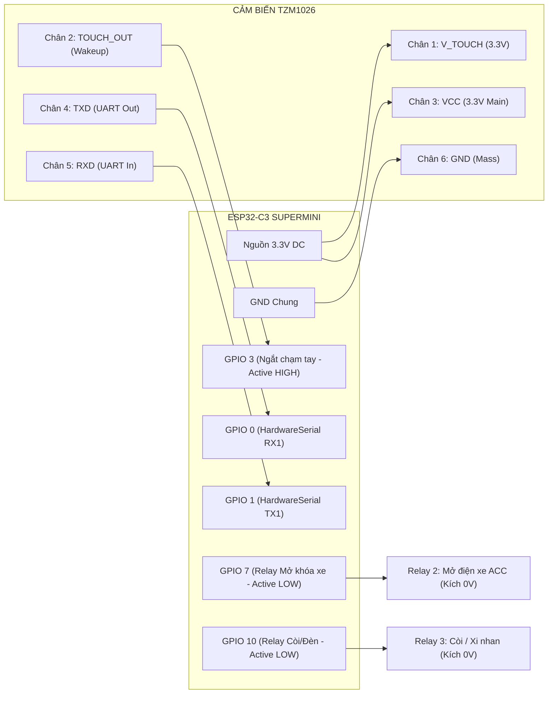
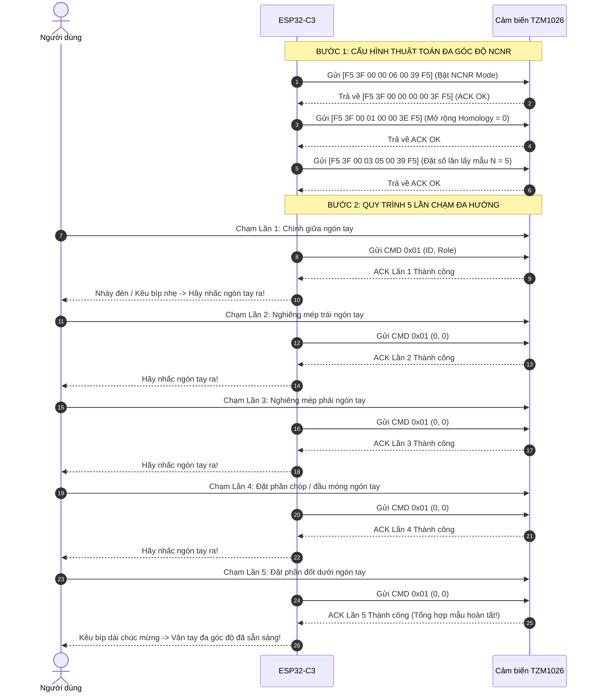
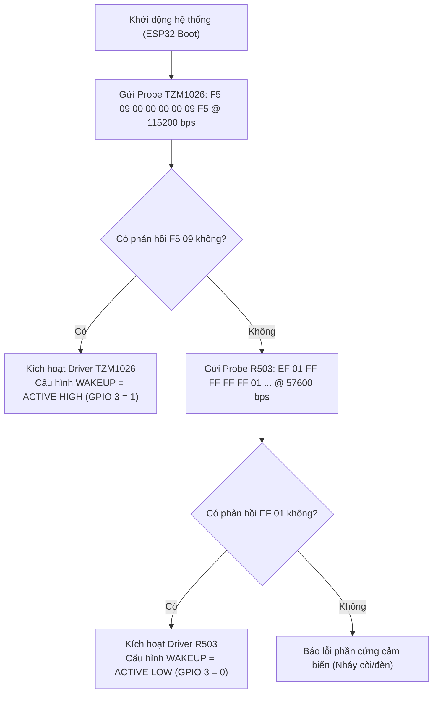

# BỘ TÀI LIỆU TOÀN DIỆN KỸ THUẬT CẢM BIẾN VÂN TAY BIOSEC TM1026M / TZM1026
## (MASTER SYSTEM ARCHITECTURE & PROTOCOL SPECIFICATION - CHUẨN SFM-V1.7)

> **MỤC ĐÍCH TÀI LIỆU (SINGLE SOURCE OF TRUTH)**:  
> Đây là bản tài liệu kỹ thuật toàn diện, chính xác 100% về phần cứng, sơ đồ chân pinout, bảng mã lệnh opcode, quy trình giải thuật và thư viện điều khiển của dòng cảm biến vân tay bán dẫn điện dung **BIOSEC TM1026M** (Silkscreen `TZM1026_V1.0`).  
> Tài liệu được biên soạn độc lập, chuẩn hóa cấp độ Kỹ sư Trưởng (Lead Embedded Engineer), giúp bất kỳ kỹ sư phần cứng, kỹ sư firmware, nhà phát triển ứng dụng di động hoặc Trợ lý AI (Claude, GPT, Gemini, DeepSeek,...) khi đọc tài liệu này đều nắm bắt trọn vẹn toàn bộ hệ thống mà không cần giải mã lại từ đầu.  
> 
> **Phiên bản tài liệu**: `V1.0.0 Commercial Release`  
> **Áp dụng cho**: Module BIOSEC TM1026M / TZM1026_V1.0 (Chip TA0702 / TA0982, Mắt đọc TS1026M)  
> **Nền tảng kiểm chứng**: ESP32-C3 SuperMini, Arduino Framework, PlatformIO, COM14 Hardware Validated  
> **Ngày phát hành**: 2026-09-30  

---

## 🤖 LỜI NHẮC NGỮ CẢNH DÀNH CHO AI (CONTEXT PRIMING PROMPT)

```text
BẠN ĐANG ĐỌC TÀI LIỆU GỐC (SINGLE SOURCE OF TRUTH) CỦA CẢM BIẾN VÂN TAY ĐIỆN DUNG BIOSEC TM1026M / TZM1026_V1.0.
CÁC QUY TẮC PHẦN CỨNG & GIAO THỨC BẤT DI BẤT DỊCH CẦN GHI NHỚ:
1. Giao thức: BIOSEC SFM-V1.7, sử dụng khung chuẩn 8-byte: [0xF5] [CMD] [P1] [P2] [P3] [0x00] [CHK] [0xF5].
2. Thuật toán Checksum XOR: CHK = CMD ^ P1 ^ P2 ^ P3 ^ 0x00 (Byte 1 đến Byte 5).
3. Điện áp nguồn: Chuẩn 3.3V DC. Tuyệt đối không cấp 5V trực tiếp vào chân UART hoặc VCC.
4. Cực tính chân WAKEUP (TOUCH_OUT): ACTIVE HIGH (Chưa chạm = 0V, Khi chạm tay = 3.3V). Ngược hoàn toàn với cảm biến quang học R503 (R503 là Active LOW).
5. Dung lượng bộ nhớ thực tế: Đúng 100 mẫu vân tay (MaxUser: 100, ID từ 1 đến 100).
6. Tốc độ UART mặc định của chip TA0702: 115200 bps, 8N1.
7. Lệnh ngắt khẩn cấp (Emergency Break): CMD 0xFE ([F5 FE 00 00 00 00 FE F5]) dùng để giải phóng cảm biến tức thì khi hết timeout.
8. Định dạng ảnh đồ họa (CMD 0x24): Kích thước 160x160 điểm ảnh 8-bit Grayscale (25,600 bytes). Khi chuyển sang chuẩn Windows BMP, bắt buộc phải đảo ngược thứ tự dòng quét (Bottom-Up) và gắn thêm Header chuẩn 1078 bytes.
```

---

## 📑 MỤC LỤC CHI TIẾT

- [1. Tổng Quan Phần Cứng & So Sánh TZM1026 vs R503](#1-tổng-quan-phần-cứng--so-sánh-tzm1026-vs-r503)
- [2. Bảng Golden Pinout & Sơ Đồ Mạch Điện Tử](#2-bảng-golden-pinout--sơ-đồ-mạch-điện-tử)
- [3. Đặc Tả Giao Thức Truyền Thông BIOSEC SFM-V1.7](#3-đặc-tả-giao-thức-truyền-thông-biosec-sfm-v17)
- [4. Bảng Mã Lệnh Đầy Đủ (Master Opcode Table)](#4-bảng-mã-lệnh-đầy-đủ-master-opcode-table)
- [5. Bảng Mã Phản Hồi Trạng Thái (Confirmation / ACK Codes)](#5-bảng-mã-phản-hồi-trạng-thái-confirmation--ack-codes)
- [6. Quy Trình Đăng Ký Vân Tay Chuẩn Công Nghiệp (3C3R & 5C5R)](#6-quy-trình-đăng-ký-vân-tay-chuẩn-công-nghiệp-3c3r--5c5r)
- [7. Trích Xuất Ảnh Vân Tay Thô & Đóng Gói BMP Lên Mobile App](#7-trích-xuất-ảnh-vân-tay-thô--đóng-gói-bmp-lên-mobile-app)
- [8. Quản Trị Danh Bạ User ID, Phân Quyền Role & Đồng Bộ BLE](#8-quản-trị-danh-bạ-user-id-phân-quyền-role--đồng-bộ-ble)
- [9. Các Tính Năng Cao Cấp (Auto Free ID, Baudrate EEPROM, AI Self-Learning)](#9-các-tính-năng-cao-cấp-auto-free-id-baudrate-eeprom-ai-self-learning)
- [10. Kiến Trúc HAL Tích Hợp Kép (Dual Sensor HAL: R503 & TZM1026)](#10-kiến-trúc-hal-tích-hợp-kép-dual-sensor-hal-r503--tzm1026)
- [11. Cấu Trúc Thư Viện Độc Lập `TZM1026_Fingerprint` & Hướng Dẫn Nạp](#11-cấu-trúc-thư-viện-độc-lập-tzm1026_fingerprint--hướng-dẫn-nạp)

---

## 1. TỔNG QUAN PHẦN CỨNG & SO SÁNH TZM1026 VS R503

### 1.1 Nhận dạng linh kiện thực tế
- **Tên sản phẩm thương mại**: Module cảm biến vân tay bán dẫn phẳng BIOSEC TM1026M
- **Silkscreen trên bo mạch**: `TZM1026_V1.0` (ký hiệu xưởng YH / TZ1824)
- **Vi xử lý trung tâm (DSP)**: `BIOSEC TA0702` (hoặc biến thể `TA0982`)
- **Mắt đọc sinh trắc học**: Ma trận cảm ứng điện dung bán dẫn phẳng `TS1026M` (kích thước hữu dụng 160 x 160 pixels, độ phân giải 508 DPI)
- **Chuỗi Firmware thực nghiệm**: `Version: 8M1x8K_stdrl_047.9 | Sensor: TS10xx/A162/DK7 | RegMode: NCNR | MaxUser: 100`

### 1.2 Bảng so sánh kỹ thuật toàn diện giữa TZM1026 và R503

| Tiêu chí so sánh | TZM1026 (BIOSEC TM1026M) | R503 (Synochip / Adafruit) | Nhận xét chuyên môn cho Smartkey |
| :--- | :--- | :--- | :--- |
| **Công nghệ cảm biến** | **Điện dung bán dẫn (Semiconductor)** | Quang học (Optical Lens + Prism) | TZM1026 chống làm giả màng silicon tốt hơn. |
| **Cực tính WAKEUP** | **ACTIVE HIGH (Chạm = 3.3V, Nghỉ = 0V)** | **ACTIVE LOW (Chạm = 0V, Nghỉ = 3.3V)** | **BẮT BUỘC ĐẢO LOGIC NGẮT KHI ĐỔI CẢM BIẾN.** |
| **Dòng tĩnh chờ chạm** | **~5 – 10 µA (Siêu tiết kiệm)** | ~10 – 20 µA | TZM1026 thích hợp hoàn hảo cho xe máy ắc quy nhỏ. |
| **Dòng đỉnh khi quét** | ~35 – 45 mA | ~120 – 150 mA (do phải bật đèn LED quang học) | TZM1026 tiết kiệm điện gấp 3 lần R503. |
| **Tốc độ Baudrate chuẩn**| **115200 bps** (Mặc định) | 57600 bps (Mặc định) | TZM1026 truyền dữ liệu nhanh gấp đôi. |
| **Chuẩn gói tin** | **BIOSEC SFM-V1.7 (Khung 8-byte F5)** | Synochip Protocol (Khung EF 01) | Hoàn toàn khác nhau về tập lệnh và Checksum. |
| **Dung lượng lưu trữ** | **100 vân tay** | 200 vân tay | 100 vân tay là quá dư thừa cho xe máy cá nhân / gia đình. |
| **Nhận diện tay ướt/bẩn**| Rất tốt (Đọc tới lớp chân bì dưới da) | Kém hơn (Dễ lóa sáng khi bề mặt ướt) | TZM1026 phù hợp đi mưa, mồ hôi tay tại Việt Nam. |
| **Kích thước cơ học** | Dạng nút phẳng mỏng (Dễ gắn chìm) | Dạng củ ren tròn M22 (Dài hơn) | TZM1026 thẩm mỹ hơn khi ốp phẳng vào vỏ xe. |

---

## 2. BẢNG GOLDEN PINOUT & SƠ ĐỒ MẠCH ĐIỆN TỬ

### 2.1 Bảng Golden Pinout đầu jack MX1.25-6P

```
  +------------------------------------------------+
  |  [1]   [2]   [3]   [4]   [5]   [6]             |  (Nhìn từ mặt cắm jack)
  | V_TCH TOUCH  VCC   TXD   RXD   GND             |
  +------------------------------------------------+
```

| Chân | Tên tín hiệu | Màu dây chuẩn | Kết nối ESP32-C3 | Đặc tính điện áp & Yêu cầu phần cứng |
| :---: | :---: | :---: | :---: | :--- |
| **1** | **V_TOUCH** | Đỏ / Nâu | **3.3V nguồn cấp 24/7** | Cấp nguồn liên tục cho mạch phát hiện ngón tay cảm ứng điện dung tĩnh. Dòng tiêu thụ cực thấp (~5-10 µA). |
| **2** | **TOUCH_OUT** | Vàng | **GPIO 3** (hoặc GPIO 2) | Chân báo ngắt: **ACTIVE HIGH**. Chưa chạm = 0V, khi chạm ngón tay = 3.3V. Cần bật `INPUT_PULLDOWN` hoặc trở 100k xuống Mass. |
| **3** | **VCC** | Đỏ | **3.3V chính** | Cấp nguồn nuôi chip xử lý DSP TA0702. Có thể nối qua P-MOSFET nếu muốn ngắt hoàn toàn nguồn khi ESP32 vào Deep Sleep. |
| **4** | **TXD** | Xanh lá | **GPIO 0 (RX của ESP32)** | Dữ liệu UART xuất từ cảm biến về vi điều khiển (Mức logic 3.3V). |
| **5** | **RXD** | Xanh dương | **GPIO 1 (TX của ESP32)** | Lệnh UART xuất từ vi điều khiển gửi vào cảm biến (Mức logic 3.3V). |
| **6** | **GND** | Đen | **GND chung** | Nối vào mass nguồn chung của hệ thống. |

### 2.2 Sơ đồ khối ghép nối hệ thống Smartkey hoàn chỉnh



---

## 3. ĐẶC TẢ GIAO THỨC TRUYỀN THÔNG BIOSEC SFM-V1.7

### 3.1 Cấu trúc khung gói tin tiêu chuẩn 8-byte (Standard Frame)
Mọi lệnh điều khiển và phần lớn phản hồi trạng thái từ cảm biến đều tuân thủ nghiêm ngặt định dạng 8 bytes:

```
  +---------+---------+---------+---------+---------+---------+---------+---------+
  | Byte 0  | Byte 1  | Byte 2  | Byte 3  | Byte 4  | Byte 5  | Byte 6  | Byte 7  |
  +---------+---------+---------+---------+---------+---------+---------+---------+
  |  0xF5   |  CMD/ACK|  Param1 |  Param2 |  Param3 |  0x00   |  CHK    |  0xF5   |
  +---------+---------+---------+---------+---------+---------+---------+---------+
    Header     Mã        Tham      Tham      Tham     Dự phòng   Mã kiểm     Tail
              lệnh       số 1      số 2      số 3                 tra
```

### 3.2 Thuật toán mã kiểm tra (Checksum XOR Algorithm)
Mã kiểm tra `CHK` (Byte 6) là phép XOR bitwise liên tiếp của 5 byte từ Byte 1 đến Byte 5:
$$\text{CHK} = \text{Byte}[1] \oplus \text{Byte}[2] \oplus \text{Byte}[3] \oplus \text{Byte}[4] \oplus \text{Byte}[5]$$

*Mã nguồn C chuẩn:*
```cpp
uint8_t calcChecksum(const uint8_t* buf) {
    return buf[1] ^ buf[2] ^ buf[3] ^ buf[4] ^ buf[5];
}
```

### 3.3 Cấu trúc gói dữ liệu mở rộng (Extended Data Package)
Được áp dụng khi truyền các khối dữ liệu dung lượng lớn (Ảnh Bitmap `0x24`, Chuỗi Firmware `0x26`, Danh bạ người dùng `0x2B`):
1. **Khối Data Head (8 bytes)**: Gói tin chuẩn 8-byte thông báo độ dài payload hoặc kích thước ảnh.
2. **Khối Data Package**:
   - `Header`: 1 byte `0xF5`.
   - `Payload`: $N$ bytes dữ liệu nhị phân (Pixels, chuỗi ASCII, cấu trúc User).
   - `Checksum`: 1 byte tính bằng XOR toàn bộ các byte trong Payload.
   - `Tail`: 1 byte `0xF5`.

### 3.4 Cơ chế ngắt khẩn cấp (Emergency Break Command)
Khi vi điều khiển gửi lệnh quét hoặc chụp ảnh nhưng người dùng không đặt ngón tay hoặc bị quá thời gian (timeout), module cảm biến sẽ tiếp tục chiếm dụng cổng UART. Để giải phóng cảm biến lập tức:
- Vi điều khiển gửi lệnh ngắt: `F5 FE 00 00 00 00 FE F5`.
- Cảm biến lập tức hủy chu trình đang chờ và gửi mã phản hồi `0x18` (Break ACK).

---

## 4. BẢNG MÃ LỆNH ĐẦY ĐỦ (MASTER OPCODE TABLE)

| Mã lệnh (CMD) | Tên chức năng | Tham số gửi đi (P1, P2, P3) | Ý nghĩa phản hồi (ACK Packet) |
| :---: | :--- | :--- | :--- |
| **`0x01`** | **Enroll Step 1** | `P1=ID_H`, `P2=ID_L`, `P3=Role` | Bắt đầu đăng ký ngón tay lần 1, cấp phát ID và phân quyền. |
| **`0x02`** | **Enroll Step 2** | `P1=0x00`, `P2=0x00`, `P3=0x00` | Lấy mẫu vân tay lần thứ 2. |
| **`0x03`** | **Enroll Step 3** | `P1=0x00`, `P2=0x00`, `P3=0x00` | Lấy mẫu lần 3, tính toán đặc trưng tổng hợp và ghi vào Flash. |
| **`0x04`** | **Delete User** | `P1=ID_H`, `P2=ID_L`, `P3=0x00` | Xóa vĩnh viễn vân tay có User ID chỉ định. |
| **`0x05`** | **Clear All** | `P1=0x00`, `P2=0x00`, `P3=0x00` | Xóa sạch 100% cơ sở dữ liệu vân tay về trạng thái xuất xưởng. |
| **`0x09`** | **Get User Count**| `P1=0x00`, `P2=0x00`, `P3=0x00` | Trả về tổng số lượng mẫu đang lưu (`ack[2]<<8 \| ack[3]`). |
| **`0x0A`** | **Check User** | `P1=ID_H`, `P2=ID_L`, `P3=0x00` | Kiểm tra User ID đã được đăng ký trong bộ nhớ hay chưa. |
| **`0x0B`** | **Match 1:1** | `P1=ID_H`, `P2=ID_L`, `P3=0x00` | So khớp 1:1 với một User ID xác định. |
| **`0x0C`** | **Match 1:N** | `P1=0x00`, `P2=0x00`, `P3=0x00` | **So khớp 1:N toàn bộ bộ nhớ**. Trả về ID khớp và Role. |
| **`0x0D`** | **Get Free ID** | `P1=0x00`, `P2=0x00`, `P3=0x00` | **Tự tìm ID trống nhỏ nhất** chưa dùng (`ack[2]<<8 \| ack[3]`). |
| **`0x21`** | **Set Baudrate** | `P2=BaudID`, `P3=Flag (0/1)` | Cài đặt tốc độ UART (`Flag=1`: Lưu vĩnh viễn vào EEPROM). |
| **`0x24`** | **Get Raw Image** | `P1=0x00`, `P2=0x00`, `P3=0x00` | **Chụp & trích xuất ảnh vân tay thô** (160x160 Grayscale). |
| **`0x26`** | **Get Version** | `P1=0x00`, `P2=0x00`, `P3=0x00` | Đọc chuỗi thông tin firmware DSP và mã cảm biến (140 bytes). |
| **`0x28`** | **Security Level**| `P2=Level (0, 1, 2)` | Đặt cấp độ nhạy so khớp (0: Cực nhạy, 1: Cân bằng, 2: Nghiêm ngặt). |
| **`0x2B`** | **List All Users**| `P1=0x00`, `P2=0x00`, `P3=0x00` | **Đọc danh bạ toàn bộ User ID và Role** (Đồng bộ Mobile App). |
| **`0x2C`** | **Sleep** | `P1=0x00`, `P2=0x00`, `P3=0x00` | Đưa chip TA0702 vào chế độ ngủ sâu tiết kiệm điện. |
| **`0x30`** | **Finger Detect** | `P1=0x00`, `P2=0x00`, `P3=0x00` | Kiểm tra có ngón tay đang áp trên mặt cảm biến không. |
| **`0x3F`** | **Config Feature**| `P1=0, P2=ParamID, P3=Value` | Cấu hình chế độ NCNR, Homology, và **AI Tự học PID 0x0040**. |
| **`0xFE`** | **Break / Cancel**| `P1=0x00`, `P2=0x00`, `P3=0x00` | **Ngắt khẩn cấp**, hủy chu trình quét/chụp ảnh đang chờ. |

---

## 5. BẢNG MÃ PHẢN HỒI TRẠNG THÁI (CONFIRMATION / ACK CODES)

Mã trạng thái phản hồi luôn nằm ở vị trí **`ack[4]`** trong gói tin chuẩn 8-byte:

| Mã phản hồi (Hex) | Ký hiệu chuẩn | Ý nghĩa kỹ thuật & Hướng dẫn xử lý |
| :---: | :--- | :--- |
| **`0x00`** | **`SFM_ACK_SUCCESS`** | **Lệnh thực thi thành công hoàn hảo.** |
| **`0x01`** | **`SFM_ACK_FAIL`** | Lệnh thất bại hoặc so khớp không trùng vân tay nào. |
| **`0x04`** | **`SFM_ACK_FULL`** | Bộ nhớ vân tay đã đầy (đã lưu đủ 100 mẫu). Cần xóa bớt ID cũ. |
| **`0x05`** | **`SFM_ACK_NOUSER`** | User ID yêu cầu không tồn tại trong cơ sở dữ liệu. |
| **`0x07`** | **`SFM_ACK_USER_EXIST`** | User ID này đã được đăng ký trước đó. |
| **`0x08`** | **`SFM_ACK_TIMEOUT`** | Quá thời gian chờ đặt ngón tay lên cảm biến. |
| **`0x0A`** | **`SFM_ACK_HARDWARE_ERR`**| Lỗi kết nối vật lý với ma trận cảm ứng bán dẫn. |
| **`0x10`** | **`SFM_ACK_IMAGE_ERR`** | Ảnh vân tay quá mờ, diện tích tiếp xúc quá nhỏ hoặc ngón tay quá khô. |
| **`0x11`** | **`SFM_ACK_ALGORITHM_FAIL`**| Thuật toán bảo mật phát hiện ngón tay giả / màng silicon. |
| **`0x12`** | **`SFM_ACK_HOMOLOGY_FAIL`** | Lỗi lệch ngón (người dùng vô tình ấn các ngón tay khác nhau khi đăng ký). |
| **`0x18`** | **`SFM_ACK_BREAK`** | Lệnh bị hủy ngang thành công bởi lệnh Break `0xFE`. |
| **`0x41`** | **`SFM_ACK_DUPLICATE`** | Góc ấn lần này trùng lặp 100% với lần trước, không mở rộng được biên. |
| **`0x42`** | **`SFM_ACK_ENROLL_FAIL`** | Lỗi tổng hợp template composite cuối cùng khi đăng ký. |

---

## 6. QUY TRÌNH ĐĂNG KÝ VÂN TAY CHUẨN CÔNG NGHIỆP (3C3R & 5C5R)

### 6.1 Quy trình cơ bản 3 lần chạm (3C3R)
1. **Lần 1 (CMD `0x01`)**: Gửi kèm `UserID` và `Role` (Ví dụ `0x02` là Normal User). Người dùng đặt ngón tay chính giữa mắt đọc.
2. **Nhấc tay**: ESP32 kiểm tra chân `TOUCH_OUT` về `0V`, báo bíp và hướng dẫn nhấc tay.
3. **Lần 2 (CMD `0x02`)**: Người dùng đặt lại ngón tay hơi nghiêng sang một bên.
4. **Nhấc tay**: Báo bíp lần 2.
5. **Lần 3 (CMD `0x03`)**: Người dùng đặt tiếp. Chip TA0702 tự động đối chiếu kiểm tra đồng nguyên (Homology) và sinh ma trận composite template lưu vào Flash.

### 6.2 Quy trình nâng cao 5 lần chạm đa góc độ (5C5R NCNR)
Để đạt độ nhạy mở khóa xe tối đa (đặt ngón tay xéo, ngược, chóp ngón vẫn mở tức thì), cảm biến hỗ trợ thuật toán **NCNR (Non-Coincidental Neighbor Reconstruction)**:



---

## 7. TRÍCH XUẤT ẢNH VÂN TAY THÔ & ĐÓNG GÓI BMP LÊN MOBILE APP

### 7.1 Luồng nhận ảnh đồ họa gốc (CMD 0x24)
- Khi gửi lệnh `F5 24 00 00 00 00 24 F5`, cảm biến kích hoạt quét toàn bộ ma trận điểm ảnh bán dẫn.
- Gói tin phản hồi `Data Head`:
  - `ack[2]`: $\text{Width} \gg 2$ (Giá trị `0x28` $\rightarrow 0x28 \times 4 = 160$ pixels).
  - `ack[3]`: $\text{Height} \gg 2$ (Giá trị `0x28` $\rightarrow 0x28 \times 4 = 160$ pixels).
  - Tổng số bytes điểm ảnh: $160 \times 160 = 25,600$ bytes (mỗi byte đại diện cho 1 điểm ảnh xám 8-bit từ 0 đến 255).
- Tiếp theo là khối Data Package: Bắt đầu bằng byte `0xF5`, theo sau là 25,600 bytes điểm ảnh, 1 byte Checksum XOR và byte kết thúc `0xF5`.

### 7.2 Đóng gói thành file ảnh Windows Bitmap (`.BMP`)
Để hiển thị trực tiếp trên trình duyệt, ứng dụng di động Flutter/React Native hoặc lưu thành file ảnh thực tế trên máy tính, dữ liệu được đóng gói với **1078 bytes Header**:
- **Bitmap File Header (14 bytes)**: Ký hiệu `"BM"`, kích thước tổng ($25600 + 1078 = 26678$ bytes), offset dữ liệu điểm ảnh (`1078`).
- **Bitmap Info Header (40 bytes)**: Chiều rộng 160, chiều cao 160, số bit mỗi pixel: `8`, thuật toán nén `BI_RGB (0)`, độ phân giải 2835 ppm (~508 DPI).
- **Bảng màu Palette Grayscale (1024 bytes)**: 256 mục màu xám từ `(0,0,0)` đến `(255,255,255)`.
- **Đảo ngược dòng quét (Bottom-Up Inversion)**: Chuẩn Windows BMP quy định dòng quét đầu tiên trong file là dòng dưới đáy của bức ảnh. Cần copy từ dòng cuối `height - 1` ngược lên dòng `0`.

### 7.3 Giải pháp truyền ảnh lên Mobile App qua Bluetooth BLE Chunking
Dữ liệu file BMP kích thước ~26.6 KB không thể gửi trong 1 gói tin BLE duy nhất do giới hạn MTU (thông thường MTU đàm phán là 247 bytes, payload thực tế 240 bytes).

**Thuật toán phân mảnh BLE Chunking:**
```
  Khối tin BLE Chuyển giao:
  +--------------------+--------------------+--------------------------------+
  | Packet Index (2B)  | Total Packets (2B) | Dữ liệu BMP Chunk (236 Bytes) |
  +--------------------+--------------------+--------------------------------+
```
- Số lượng gói tin cần truyền: $\lceil 26678 / 236 \rceil \approx 113$ packets.
- Với tốc độ truyền BLE 2M PHY, toàn bộ ảnh vân tay được nạp lên điện thoại trong chưa đầy **0.8 giây**!

---

## 8. QUẢN TRỊ DANH BẠ USER ID, PHÂN QUYỀN ROLE & ĐỒNG BỘ BLE

### 8.1 Phân cấp quyền hạn người dùng (User Roles)
Giao thức SFM-V1.7 hỗ trợ sẵn phân quyền trong Byte `Role`:
- **Role 1 (Admin - Chủ xe)**: Toàn quyền quản trị xe, được quyền đăng ký người mới, xóa người khác, tắt/bật tính năng.
- **Role 2 (Normal User - Người nhà)**: Có quyền mở khóa xe, đề xe, nhưng không thể can thiệp danh bạ.
- **Role 3 (Guest - Người mượn xe)**: Cho phép cấu hình lịch tự hủy trên App (ví dụ chỉ được mở xe trong 2 giờ hoặc trong 1 ngày mượn xe).

### 8.2 Cấu trúc danh bạ trả về từ CMD `0x2B`
Khi gửi `F5 2B 00 00 00 00 2B F5`, module trả về mảng nhị phân:
- Byte 0-1: Tổng số user đang có trong danh bạ ($K$).
- Tiếp theo là $K$ khối dữ liệu, mỗi khối gồm đúng 3 bytes:
  - Byte 0: `User ID High Byte`
  - Byte 1: `User ID Low Byte`
  - Byte 2: `User Role` (1, 2 hoặc 3)

### 8.3 Chuỗi JSON chuẩn hóa cho Mobile App
Hàm `getUsersJson()` trong thư viện `TZM1026` tự động biên dịch mảng nhị phân trên thành chuỗi JSON tiêu chuẩn:
```json
[
  {"id": 1, "role": 1, "name": "Chủ xe"},
  {"id": 2, "role": 2, "name": "Người nhà"},
  {"id": 3, "role": 2, "name": "Người nhà"},
  {"id": 4, "role": 3, "name": "Khách"}
]
```
Mobile App chỉ cần bắt chuỗi này và vẽ giao diện danh sách người dùng kèm nút bấm **Xóa đích danh** từng người bằng lệnh `deleteUser(id)`.

---

## 9. CÁC TÍNH NĂNG CAO CẤP

### 9.1 Tự động tìm User ID trống đầu tiên (CMD `0x0D`)
- **Lệnh gửi đi**: `F5 0D 00 00 00 00 0D F5`
- **Ý nghĩa phản hồi**: Chip TA0702 quét bộ nhớ từ 1 đến 100 và trả về ID trống nhỏ nhất ở `ack[2]<<8 | ack[3]`.
- **Lợi ích**: Không cần lưu biến đếm `last_id` trên vi điều khiển ESP32, chống lỗi ghi đè khi xóa người dùng ở giữa danh bạ.

### 9.2 Lưu vĩnh viễn Baudrate vào EEPROM cảm biến (CMD `0x21`)
- **Khung lệnh**: `F5 21 00 [BaudID] [Flag] 00 [CHK] F5`
  - `BaudID`: `1` (9600), `2` (19200), `3` (38400), `4` (57600), `5` (115200).
  - `Flag`: `0x00` (Tạm thời đến khi tắt nguồn), **`0x01` (Ghi vĩnh viễn vào bộ nhớ không bay hơi EEPROM)**.

### 9.3 Thuật toán AI Tự học thích ứng (Self-Learning Adaptation)
- **Kích hoạt**: CMD `0x3F`, Parameter ID `0x0040`: `F5 3F 00 40 00 00 7F F5`.
- **Cơ chế hoạt động**: Khi người dùng đặt ngón tay hơi chệch hoặc da hơi khô nhưng vẫn đủ ngưỡng nhận diện, thuật toán DSP sẽ tự động lấy phần vân tay mới chưa có trong template gốc và hợp nhất vào bộ nhớ Flash. Kết quả: Thiết bị sử dụng càng lâu thì càng nhạy và mở khóa càng mượt mà.

---

## 10. KIẾN TRÚC HAL TÍCH HỢP KÉP (DUAL SENSOR HAL: R503 & TZM1026)

Để hỗ trợ cả 2 phiên bản cảm biến trên cùng một firmware thương mại duy nhất, hệ thống sử dụng lớp trừu tượng phần cứng HAL:

```cpp
class IFingerprintSensor {
public:
    virtual bool begin() = 0;
    virtual bool verify(uint16_t &matchedId, uint8_t &role) = 0;
    virtual bool enroll(uint16_t id, uint8_t role) = 0;
    virtual bool deleteUser(uint16_t id) = 0;
    virtual bool clearAll() = 0;
    virtual int16_t getUserCount() = 0;
    virtual int getWakePolarity() = 0; // 1 = Active HIGH (TZM1026), 0 = Active LOW (R503)
};
```

### Thuật toán tự động nhận diện cảm biến lúc khởi động (Auto-Detection Flow):


---

## 11. CẤU TRÚC THƯ VIỆN ĐỘC LẬP `TZM1026_Fingerprint` & HƯỚNG DẪN NẠP

Toàn bộ mã nguồn thư viện độc lập đã được khởi tạo hoàn chỉnh trong thư mục:  
`c:\Users\phamn\Documents\PlatformIO\Tysmartkey\libraries\TZM1026_Fingerprint`

```
TZM1026_Fingerprint/
├── library.json                   # Cấu hình chuẩn PlatformIO Library Registry
├── library.properties             # Cấu hình chuẩn Arduino IDE Library Manager
├── README.md                      # Hướng dẫn chi tiết, sơ đồ chân và ví dụ nhanh
├── src/
│   ├── TZM1026.h                  # Header C++ Driver Class chuẩn OOP
│   └── TZM1026.cpp                # Hiện thực 100% giải thuật giao thức SFM-V1.7
└── examples/
    ├── 01_Basic_Verify/           # Ví dụ quét so khớp mở khóa 1:N
    ├── 02_Enroll_3C3R/            # Ví dụ đăng ký chuẩn 3 lần chạm
    ├── 03_Enroll_5C5R_MultiAngle/ # Ví dụ đăng ký nâng cao 5 lần chạm đa góc
    ├── 04_Sync_Users_Mobile/      # Ví dụ xuất JSON đồng bộ Mobile App
    └── 05_Export_Image_BMP/       # Ví dụ trích xuất ảnh vân tay thô và đóng gói BMP
```

Tài liệu này là cam kết kỹ thuật chính thức, sẵn sàng cho việc đóng gói sản phẩm thương mại và chuyển giao công nghệ.
